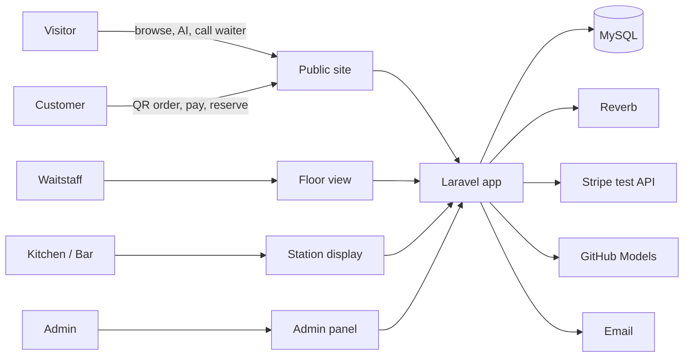

# 2. Overview and Decisions

## 2.1 System summary
Coolaroo RMS serves five groups: **visitors** browse the website, menu, reviews and AI assistant; **customers** scan a table QR, order, pay and track orders, book tables and leave feedback; **waitstaff** run the floor, take orders and cash, and manage reservations; **kitchen and bar** prepare station lines; **admin** controls menu, tables, staff, refunds, settings and reports.

## 2.2 Decisions log
| Area | Decision |
|---|---|
| Identity | Customer accounts required to order and reserve. Staff can order for guests. Visitors can browse, call waiter from a table, and use AI. |
| QR login | Scanning a table QR requires login first; QR login page shows Call waiter and homepage link; after login the ordering menu opens. |
| Table sessions | None. restaurant_table.status + visit rows + audit_log. |
| Payment | Pay before stations see the order. Stripe Checkout (test mode) confirmed by server-side session retrieval — no webhooks. Cash recorded by staff with rounding and adjustments. |
| Bills | One order = one payment. No split bills, tips or surcharges. |
| Order expiry | None. Unpaid orders cleaned up daily at closing. |
| Stock | Availability toggle + daily limit shared across sizes. QR checkout needs 5× buffer; exact atomic deduction at payment; staff orders use exact check; conflicts flagged and resolved by staff. |
| Refunds | Requested by staff only, issued by Admin. Stripe, cash or manual. Return to stock is Admin's choice (default no). |
| Menu | Sizes with prices, per-item add-on groups with priced options, sale windows, automatic Specials, featured items. No bundles or happy hour. |
| Routing | Order lines route to Kitchen or Bar by item; per-station ETA on the order. |
| Roles | Admin, Waitstaff, Kitchen, Bar (+ Customer, Visitor). |
| Real-time | Laravel Reverb + Echo. Alerts are live-only; lists rebuild from data. |
| Notifications | In-app only for orders. Reservation emails: received, confirmed, declined, expired, cancelled, reminder. |
| Reservations | Staff approve all online requests. Tables assigned by T–30 (multiple allowed), Reserved at T–30. No-shows flag the account; trust badge. Customer changes locked within 2 h; cancel warning. |
| Feedback | One per served, paid QR order. Public true average (≥ 10) + admin-featured reviews. |
| AI | Chatbot + meal builder via GitHub Models (OpenAI models, free tier). Everyone can use; no app limits; admin on/off. |
| Site switches | Pause QR ordering, pause online reservations, AI on/off. |
| Alcohol | No special software rule; responsible service at delivery. |
| Hosting | Local XAMPP (PHP 8.5) for development and report screenshots; VPS (Ubuntu, PHP 8.5) for the deployment demo, to be verified at M6 (O5). |
| Testing | Selenium WebDriver (no approval needed per guideline). |
| Tooling | Antigravity (Google AI Pro) as primary coding agent, Claude Code in VS Code for hard reasoning, Claude chat for design and documents. Repo is tool-neutral: AGENTS.md + docs/PROGRESS.md + git. Developer writes the code; agents explain and plan. |
| CSS | Hand-written style.css (public, W3C-validated) and dashboard.css (staff/admin). |
| ERD | Package A: 25 entities. visit repurposed; remember_token table replaced by column; surrogate keys for order_item and payment. |

## 2.3 Features cut or replaced
| Feature | Replacement |
|---|---|
| Cash reconciliation (FR54) | Cash by staff in Sales Report |
| Blackout dates (FR92) | Pause online reservations, inactive slots, decline |
| Reusable add-on groups | Groups per item |
| Add-on option allergens | Included in item allergen tags (BR61) |
| Order tickets table | Station status on order_item lines |
| Persisted staff alerts | Live-only alerts |
| AI usage table | audit_log ai_request |
| Stripe webhooks | Session retrieval + reconcile job |
| Happy hour | Sale prices / Specials only |
| Customer deactivation, anonymisation, sold_today correction, Stripe/cash switches | Not built |

## 2.4 Open items
| # | Item | Owner |
|---|---|---|
| O1 | Selenium language: Python + pytest (recommended) or Java | Rafi |
| O5 | VPS deployment is the plan, not an assumption: confirmed only when T190–T191 actually provision and serve the app. If it fails at M6, fall back to local-only and record it here. | Rafi |
| O2 | Logo and final colour tokens (style.css marks them unfinalised) | Team |
| O3 | Confirm "PHP4 validation" in guideline means php -l | Lecturer |
| O4 | Hero carousel: guideline note mentions Owl Carousel (jQuery); vanilla alternative possible | Rafi |
