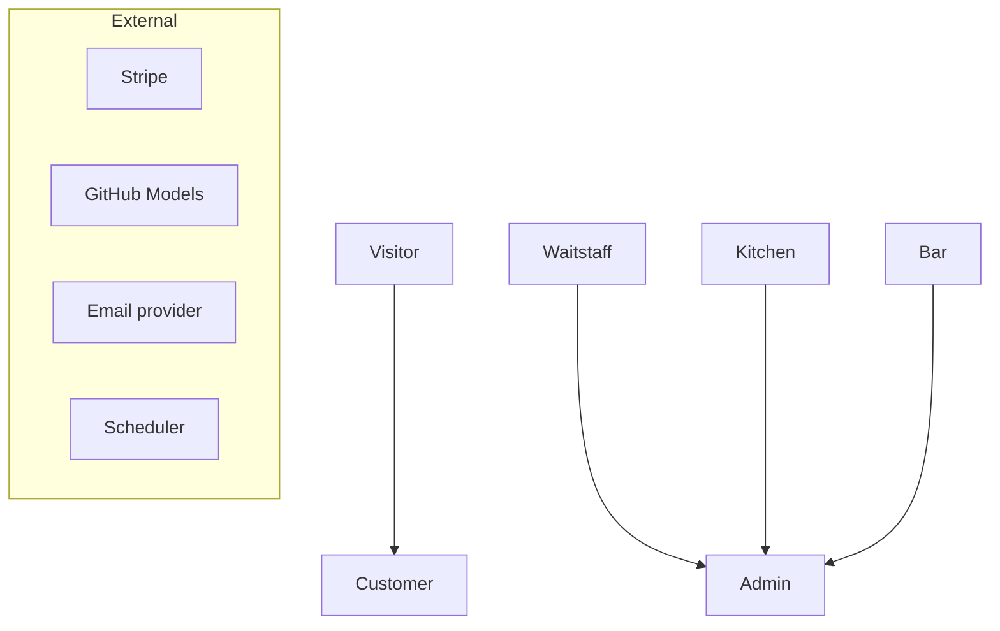

# 4. Use Cases

## 4.1 Actors

Arrows point from a role to the role that inherits it: Customer can do everything Visitor can; Admin can do everything Waitstaff, Kitchen and Bar can.

Cross-cutting: FR04 (access control), FR21 (table status recording) and FR89 (audit) are included in every relevant use case.

## 4.2 Catalogue
| ID | Use case | Actors | FRs |
|---|---|---|---|
| UC01 | Browse menu | Visitor | FR32, FR33, FR34 |
| UC02 | Call waiter | Visitor, Customer | FR40 |
| UC03 | View public ratings | Visitor | FR80 |
| UC04 | Register account | Visitor | FR01, FR06 |
| UC05 | Log in, log out, reset password | All users | FR03, FR05 |
| UC06 | Manage profile | Customer, Staff | FR07 |
| UC07 | Scan table QR | Visitor, Customer | FR31, FR69 |
| UC08 | Build cart | Customer | FR35, FR36 |
| UC09 | Use AI assistant | Visitor, Customer, GitHub Models | FR43, FR44 |
| UC10 | Place and pay for order | Customer, Stripe | FR37, FR46, FR47, FR48, FR55 |
| UC11 | Track order and view receipt | Customer | FR38, FR39, FR53 |
| UC12 | Cancel unpaid order | Customer | FR41 |
| UC13 | Request reservation | Customer, Email | FR61, FR62, FR74 |
| UC14 | Manage my reservations | Customer, Email | FR66, FR67, FR72 |
| UC15 | Submit feedback | Customer | FR76 |
| UC16 | Monitor floor and alerts | Waitstaff | FR16, FR71, FR73 |
| UC17 | Seat walk-in | Waitstaff | FR17, FR21 |
| UC18 | Clear table | Waitstaff | FR18, FR21 |
| UC19 | Take order for table | Waitstaff, Stripe | FR42 |
| UC20 | Collect cash payment | Waitstaff | FR49 |
| UC21 | Serve ready order | Waitstaff | FR60 |
| UC22 | Review reservation request | Waitstaff, Email | FR63, FR09, FR68 |
| UC23 | Create phone reservation | Waitstaff | FR64 |
| UC24 | Assign, unassign or reassign tables | Waitstaff | FR65, FR95 |
| UC25 | Seat reservation or mark no-show | Waitstaff | FR69, FR70 |
| UC26 | Request refund | Waitstaff, Kitchen, Bar | FR51 |
| UC27 | Reconcile cash at shift end | — | FR54 (removed) |
| UC28 | Process station orders | Kitchen, Bar | FR56, FR57, FR58, FR59 |
| UC29 | Mark item sold out | Kitchen, Bar | FR29 |
| UC30 | Manage staff accounts | Admin | FR02, FR08 |
| UC31 | Manage tables and QR codes | Admin | FR11–FR15, FR20 |
| UC32 | Manage menu | Admin | FR22–FR28, FR30, FR101 |
| UC33 | Manage orders and refunds | Admin, Stripe | FR52, FR102 |
| UC34 | Moderate feedback | Admin | FR77, FR78, FR79 |
| UC35 | View dashboard and reports | Admin | FR45, FR81–FR88 |
| UC36 | Search audit log and archive | Admin | FR90, FR99 |
| UC37 | Manage settings and switches | Admin | FR91, FR96, FR97, FR98, FR100 |
| UC38 | Manage customers | Admin | FR103, FR09, FR10 |
| UC39 | Run scheduled jobs | Scheduler, Stripe, Email | FR19, FR47, FR50, FR70, FR71, FR75 |
| UC40 | Cancel unpaid order (staff) | Waitstaff, Admin | FR93 |
| UC41 | Resolve stock conflict | Kitchen, Bar, Admin | FR94 |

## 4.3 Specifications

### UC01 Browse menu
| | |
|---|---|
| **Actors** | Visitor |
| **FRs** | FR32, FR33, FR34 |
| **Precondition** | None |
| **Main flow** | 1. Open homepage menu section or /menu. 2. Choose Specials or a category, apply allergen/dietary filters. 3. Open item for sizes, add-ons, nutrition. |
| **Alternates / exceptions** | Sold-out items disabled. Add to cart outside a table shows scan prompt (UC08). |
| **Rules** | BR20, BR57, BR59 |

### UC02 Call waiter
| | |
|---|---|
| **Actors** | Visitor, Customer |
| **FRs** | FR40 |
| **Precondition** | Opened a valid table QR (ordering menu or QR login page) |
| **Main flow** | 1. Tap Call waiter. 2. System checks cooldown and broadcasts alert to floor. 3. Page confirms 'A waiter is on the way'. |
| **Alternates / exceptions** | Within cooldown: 'Already requested'. Inactive table: unavailable page. |
| **Rules** | BR07, BR50 |

### UC03 View public ratings
| | |
|---|---|
| **Actors** | Visitor |
| **FRs** | FR80 |
| **Precondition** | None |
| **Main flow** | 1. Open homepage. 2. See averages with count and featured reviews. |
| **Alternates / exceptions** | Fewer than 10 reviews: averages hidden. |
| **Rules** | BR41, BR45 |

### UC04 Register account
| | |
|---|---|
| **Actors** | Visitor |
| **FRs** | FR01, FR06 |
| **Precondition** | Not logged in |
| **Main flow** | 1. Enter name, email, mobile, password. 2. System validates, creates account, sends verification email, logs in. 3. Redirect to intended page (e.g. table ordering menu). |
| **Alternates / exceptions** | Email or mobile taken. Unverified accounts can order but not reserve. |
| **Rules** | BR42, BR52 |

### UC05 Log in, log out, reset password
| | |
|---|---|
| **Actors** | All users |
| **FRs** | FR03, FR05 |
| **Precondition** | — |
| **Main flow** | 1. Enter credentials. 2. Authenticate and redirect (staff by role landing screen; customer to intended page). |
| **Alternates / exceptions** | Forgot password → reset link 60 min. Throttled after 5 attempts. Deactivated staff refused. Staff timeout. |
| **Rules** | BR51, BR60, NFR05 |

### UC06 Manage profile
| | |
|---|---|
| **Actors** | Customer, Staff |
| **FRs** | FR07 |
| **Precondition** | Logged in |
| **Main flow** | 1. Edit name, mobile or password. 2. Save. |
| **Alternates / exceptions** | Email change re-verifies. Mobile taken. Staff cannot change role. |
| **Rules** | BR52 |

### UC07 Scan table QR
| | |
|---|---|
| **Actors** | Visitor, Customer |
| **FRs** | FR31, FR69 |
| **Precondition** | Table has printed QR |
| **Main flow** | 1. Scan. 2. Validate signature and active table. 3. If logged out, show QR login page (login/register, Call waiter, homepage link). 4. After login: Available/Occupied table opens ordering menu bound to that table. |
| **Alternates / exceptions** | Reserved + holder in window: tables Occupied, reservation seated, ordering opens. Reserved + other user: reserved notice + Call waiter. Tampered QR: 403. Inactive: unavailable page. Different table than current cart: confirm clearing cart. |
| **Rules** | BR02, BR03, BR07, BR56, BR57 |

### UC08 Build cart
| | |
|---|---|
| **Actors** | Customer |
| **FRs** | FR35, FR36 |
| **Precondition** | Logged in with table context; QR ordering enabled |
| **Main flow** | 1. Open item. 2. Choose size, add-ons, quantity, special request. 3. Validate and add line. 4. Edit/remove lines; totals update. |
| **Alternates / exceptions** | No table context: scan prompt. QR ordering paused: message. Required group missing or too many options. Item sells out: flagged live. |
| **Rules** | BR16, BR17, BR20, BR21, BR57, BR58 |

### UC09 Use AI assistant
| | |
|---|---|
| **Actors** | Visitor, Customer, GitHub Models |
| **FRs** | FR43, FR44 |
| **Precondition** | ai_enabled = 1 |
| **Main flow** | 1. Ask a question in the chat widget, or submit budget/party size/dietary/preferences on /meal-builder. 2. Server sends live menu + venue context to GitHub Models. 3. Validate returned IDs, calculate totals. 4. Show answer or suggestion cards. |
| **Alternates / exceptions** | Outside table context suggestions show scan prompt instead of Add to cart. Invalid IDs dropped. Off-topic declined. Provider limit or error: 'assistant busy'. |
| **Rules** | BR46–BR49 |

### UC10 Place and pay for order
| | |
|---|---|
| **Actors** | Customer, Stripe |
| **FRs** | FR37, FR46, FR47, FR48, FR55 |
| **Precondition** | Cart has lines; table allows ordering |
| **Main flow** | 1. Checkout: revalidate, 5× buffer check, create pending_payment order. 2. Choose Stripe or cash. Stripe: 3a. Create Checkout Session and redirect. 4a. Return URL: server retrieves session; if paid → PaymentService marks paid (stock deducted, lines to stations, ETAs, table Occupied). Cash: 3b. Floor cash list updates; continue UC20. |
| **Alternates / exceptions** | Buffer check fails: 'You can order up to X'. Payment not completed: order stays pending; 'Check payment status' button or reconcile job. Duplicate submit blocked. Exact check fails at payment: paid + stock conflict (UC41). |
| **Rules** | BR01, BR08, BR09, BR10, BR18, BR24, BR25, BR54 |

### UC11 Track order and view receipt
| | |
|---|---|
| **Actors** | Customer |
| **FRs** | FR38, FR39, FR53 |
| **Precondition** | Order exists |
| **Main flow** | 1. Open order page. 2. Live timeline with station ETAs. 3. Ready alert while open. 4. Download PDF receipt from My orders. |
| **Alternates / exceptions** | Reconnect re-fetches state. |
| **Rules** | BR28, BR30, NFR09 |

### UC12 Cancel unpaid order
| | |
|---|---|
| **Actors** | Customer |
| **FRs** | FR41 |
| **Precondition** | Order pending_payment |
| **Main flow** | 1. Tap Cancel. 2. Expire Stripe session if any. 3. Order cancelled. |
| **Alternates / exceptions** | Paid order: no cancel button; message to ask staff. |
| **Rules** | BR29 |

### UC13 Request reservation
| | |
|---|---|
| **Actors** | Customer, Email |
| **FRs** | FR61, FR62, FR74 |
| **Precondition** | Verified email + mobile; online reservations enabled |
| **Main flow** | 1. Pick date (closed weekdays greyed, ≤ 60 days) and party size. 2. Pick an available time. 3. Add notes, submit. 4. Reservation requested; email sent. |
| **Alternates / exceptions** | Visitor: login at step 3, wizard state kept. Too soon/too large: call us. Online paused: call-us message. Slot fills before submit. |
| **Rules** | BR31, BR32, BR34, BR35, BR42, BR58 |

### UC14 Manage my reservations
| | |
|---|---|
| **Actors** | Customer, Email |
| **FRs** | FR66, FR67, FR72 |
| **Precondition** | Logged in |
| **Main flow** | 1. Open My reservations. 2. Update or cancel. |
| **Alternates / exceptions** | Date/time/party change → requested, tables unlinked, email; blocked within 2 h. Cancel shows warning; late cancellation recorded; email. |
| **Rules** | BR36, BR38, BR64 |

### UC15 Submit feedback
| | |
|---|---|
| **Actors** | Customer |
| **FRs** | FR76 |
| **Precondition** | Served, paid QR order without feedback |
| **Main flow** | 1. Open order. 2. Rate food and service, comment. 3. Submit. |
| **Alternates / exceptions** | Already submitted. Staff-taken orders not eligible. |
| **Rules** | BR43, BR53 |

### UC16 Monitor floor and alerts
| | |
|---|---|
| **Actors** | Waitstaff |
| **FRs** | FR16, FR71, FR73 |
| **Precondition** | Logged in |
| **Main flow** | 1. Open floor view. 2. See tables, next bookings, active orders, ready-to-serve, cash waiting. 3. Receive live alerts. |
| **Alternates / exceptions** | Reconnect re-fetches lists. QR ordering paused banner. |
| **Rules** | BR04, NFR09 |

### UC17 Seat walk-in
| | |
|---|---|
| **Actors** | Waitstaff |
| **FRs** | FR17, FR21 |
| **Precondition** | Available tables |
| **Main flow** | 1. Select tables. 2. Seat. 3. Tables Occupied, visits opened, audited. |
| **Alternates / exceptions** | Reserved or inactive tables blocked. |
| **Rules** | BR07 |

### UC18 Clear table
| | |
|---|---|
| **Actors** | Waitstaff |
| **FRs** | FR18, FR21 |
| **Precondition** | Occupied table(s) |
| **Main flow** | 1. Select table or group. 2. Clear. 3. Tables Available, visits closed, audited. |
| **Alternates / exceptions** | Active orders: confirm. Last visit of a seated reservation closed → reservation completed. |
| **Rules** | BR06, BR55 |

### UC19 Take order for table
| | |
|---|---|
| **Actors** | Waitstaff, Stripe |
| **FRs** | FR42 |
| **Precondition** | Logged in |
| **Main flow** | 1. Select table. 2. Build cart (UC08 rules, exact stock check). 3. Checkout creates pending_payment order with staff. 4. Cash (UC20) or show Stripe QR; staff taps Check payment. 5. On payment lines go to stations. |
| **Alternates / exceptions** | Same as UC10. Works while QR ordering paused. |
| **Rules** | BR08, BR53, BR25 |

### UC20 Collect cash payment
| | |
|---|---|
| **Actors** | Waitstaff |
| **FRs** | FR49 |
| **Precondition** | Order pending_payment, cash |
| **Main flow** | 1. Open cash item. 2. See rounded amount due. 3. Enter received; change shown. 4. Optional adjustment with category + note. 5. Confirm → paid, stock, lines to stations. |
| **Alternates / exceptions** | Adjustment without note blocked. Exact stock check would fail: warning before confirm. |
| **Rules** | BR22, BR23, BR54 |

### UC21 Serve ready order
| | |
|---|---|
| **Actors** | Waitstaff |
| **FRs** | FR60 |
| **Precondition** | Lines ready |
| **Main flow** | 1. Open Ready to serve. 2. Deliver. 3. Mark served for the station. 4. Customer timeline updates. |
| **Alternates / exceptions** | — |
| **Rules** | BR28 |

### UC22 Review reservation request
| | |
|---|---|
| **Actors** | Waitstaff, Email |
| **FRs** | FR63, FR09, FR68 |
| **Precondition** | Pending request |
| **Main flow** | 1. Open request with trust profile. 2. Approve (capacity check) → confirmed, email; optionally assign tables. |
| **Alternates / exceptions** | Decline with reason → email. Over capacity blocked. |
| **Rules** | BR31, BR33, BR40 |

### UC23 Create phone reservation
| | |
|---|---|
| **Actors** | Waitstaff |
| **FRs** | FR64 |
| **Precondition** | Logged in |
| **Main flow** | 1. Search account or enter guest name/mobile. 2. Date, time, party. 3. Confirmed. |
| **Alternates / exceptions** | Over capacity. |
| **Rules** | BR31, BR33 |

### UC24 Assign, unassign or reassign tables
| | |
|---|---|
| **Actors** | Waitstaff |
| **FRs** | FR65, FR95 |
| **Precondition** | Confirmed booking |
| **Main flow** | 1. Select tables. 2. Validate seats and overlap. 3. Create visit rows. 4. At T–30 tables Reserved + sign alert. |
| **Alternates / exceptions** | Unassign/reassign closes visit rows; Reserved table returns Available. Not enough seats, overlap, inactive. |
| **Rules** | BR04, BR33, BR64 |

### UC25 Seat reservation or mark no-show
| | |
|---|---|
| **Actors** | Waitstaff |
| **FRs** | FR69, FR70 |
| **Precondition** | Confirmed booking |
| **Main flow** | Seat: guest arrives → staff Open (or holder scans) → tables Occupied, visits opened, seated. No-show: after grace system suggests → staff confirm → no_show, flagged, visits closed. |
| **Alternates / exceptions** | — |
| **Rules** | BR03, BR39, BR40 |

### UC26 Request refund
| | |
|---|---|
| **Actors** | Waitstaff, Kitchen, Bar |
| **FRs** | FR51 |
| **Precondition** | Paid order |
| **Main flow** | 1. Open order. 2. Select lines, qty, reason. 3. Submit → admin alert. |
| **Alternates / exceptions** | Lines already fully refunded or requested. |
| **Rules** | BR27 |

### UC27 Reconcile cash at shift end
| | |
|---|---|
| **Actors** | — |
| **FRs** | FR54 (removed) |
| **Precondition** | — |
| **Main flow** | Removed. See Sales Report cash by staff (FR82). |
| **Alternates / exceptions** | — |
| **Rules** | — |

### UC28 Process station orders
| | |
|---|---|
| **Actors** | Kitchen, Bar |
| **FRs** | FR56, FR57, FR58, FR59 |
| **Precondition** | Logged in |
| **Main flow** | 1. Queue shows paid orders' station lines live with sound. 2. Start → preparing. 3. Ready → ready, floor alerted. |
| **Alternates / exceptions** | Filter. Adjust ETA. Admin switches station. Cannot make item: resolve conflict or request refund. |
| **Rules** | BR28, BR30 |

### UC29 Mark item sold out
| | |
|---|---|
| **Actors** | Kitchen, Bar |
| **FRs** | FR29 |
| **Precondition** | Logged in |
| **Main flow** | 1. Find item/option. 2. Toggle. 3. Menus update live; audited. |
| **Alternates / exceptions** | Other station items hidden. |
| **Rules** | BR12, BR14 |

### UC30 Manage staff accounts
| | |
|---|---|
| **Actors** | Admin |
| **FRs** | FR02, FR08 |
| **Precondition** | Admin |
| **Main flow** | 1. Create staff with role. 2. Edit, deactivate, reactivate. |
| **Alternates / exceptions** | Cannot deactivate self or last admin. Deactivation ends sessions, archives snapshot. |
| **Rules** | BR60, BR62 |

### UC31 Manage tables and QR codes
| | |
|---|---|
| **Actors** | Admin |
| **FRs** | FR11–FR15, FR20 |
| **Precondition** | Admin |
| **Main flow** | 1. Create/edit table. 2. Generate QR. 3. Download PNG/PDF. 4. Deactivate/reactivate. 5. Override status with reason. |
| **Alternates / exceptions** | Duplicate number. Seats below assigned party: warning. |
| **Rules** | BR07, BR62, NFR04 |

### UC32 Manage menu
| | |
|---|---|
| **Actors** | Admin |
| **FRs** | FR22–FR28, FR30, FR101 |
| **Precondition** | Admin |
| **Main flow** | 1. Manage categories, allergens, dietary tags. 2. Create/edit item with station, prep time, tags, nutrition, featured. 3. Sizes, prices, sale windows. 4. Add-on groups/options. 5. Daily limit. 6. Archive. |
| **Alternates / exceptions** | Item without size cannot save. Category with items cannot be deleted. |
| **Rules** | BR10, BR15, BR16, BR20, BR59, BR61, BR62 |

### UC33 Manage orders and refunds
| | |
|---|---|
| **Actors** | Admin, Stripe |
| **FRs** | FR52, FR102 |
| **Precondition** | Admin |
| **Main flow** | 1. Search orders; open detail. 2. Open refund request or refund directly: lines, qty, method. 3. Stripe via API / cash / manual reference. 4. Tick return to stock if appropriate. 5. Complete. |
| **Alternates / exceptions** | Reject with reason. Stripe API error: failed, retry. Exceeds amount paid. |
| **Rules** | BR13, BR27 |

### UC34 Moderate feedback
| | |
|---|---|
| **Actors** | Admin |
| **FRs** | FR77, FR78, FR79 |
| **Precondition** | Admin |
| **Main flow** | 1. Filter. 2. Reply. 3. Hide/unhide with reason. 4. Feature/unfeature. |
| **Alternates / exceptions** | Hidden cannot be featured. |
| **Rules** | BR44, BR45 |

### UC35 View dashboard and reports
| | |
|---|---|
| **Actors** | Admin |
| **FRs** | FR45, FR81–FR88 |
| **Precondition** | Admin |
| **Main flow** | 1. Live dashboard (15 widgets). 2. Choose report and date range. 3. Export PDF/CSV. |
| **Alternates / exceptions** | — |
| **Rules** | — |

### UC36 Search audit log and archive
| | |
|---|---|
| **Actors** | Admin |
| **FRs** | FR90, FR99 |
| **Precondition** | Admin |
| **Main flow** | 1. Filter by user, action, entity, date. 2. View before/after. 3. Archived records tab: view snapshots. |
| **Alternates / exceptions** | — |
| **Rules** | BR62, NFR14 |

### UC37 Manage settings and switches
| | |
|---|---|
| **Actors** | Admin |
| **FRs** | FR91, FR96, FR97, FR98, FR100 |
| **Precondition** | Admin |
| **Main flow** | 1. Edit venue details, hours, closed weekdays, reservation rules, timers. 2. Manage time slots. 3. Toggle QR ordering, online reservations, AI. |
| **Alternates / exceptions** | Invalid values rejected. Changes audited, cache cleared. |
| **Rules** | BR58, BR49 |

### UC38 Manage customers
| | |
|---|---|
| **Actors** | Admin |
| **FRs** | FR103, FR09, FR10 |
| **Precondition** | Admin |
| **Main flow** | 1. Search customers. 2. Open trust profile. 3. Clear a no-show with reason. |
| **Alternates / exceptions** | — |
| **Rules** | BR40 |

### UC39 Run scheduled jobs
| | |
|---|---|
| **Actors** | Scheduler, Stripe, Email |
| **FRs** | FR19, FR47, FR50, FR70, FR71, FR75 |
| **Precondition** | cron / schedule:work |
| **Main flow** | Reset stock; reconcile pending Stripe payments; clean up unpaid orders at close; auto-clear tables; switch Reserved at T–30 + alerts; expire requests; send reminders; suggest no-shows. |
| **Alternates / exceptions** | Failures logged and retried. |
| **Rules** | BR04, BR05, BR11, BR25, BR26, BR37, BR39 |

### UC40 Cancel unpaid order (staff)
| | |
|---|---|
| **Actors** | Waitstaff, Admin |
| **FRs** | FR93 |
| **Precondition** | Order pending_payment |
| **Main flow** | 1. Open order from cash list or orders page. 2. Cancel with reason. 3. Stripe session expired; order cancelled; audited. |
| **Alternates / exceptions** | Order already paid: not allowed (use refund). |
| **Rules** | BR63 |

### UC41 Resolve stock conflict
| | |
|---|---|
| **Actors** | Kitchen, Bar, Admin |
| **FRs** | FR94 |
| **Precondition** | Order has_stock_conflict = 1 |
| **Main flow** | 1. Open flagged order. 2. Choose 'will make it' or 'raise refund request'. 3. Flag cleared; audited. |
| **Alternates / exceptions** | Refund path opens UC26. |
| **Rules** | BR54 |
