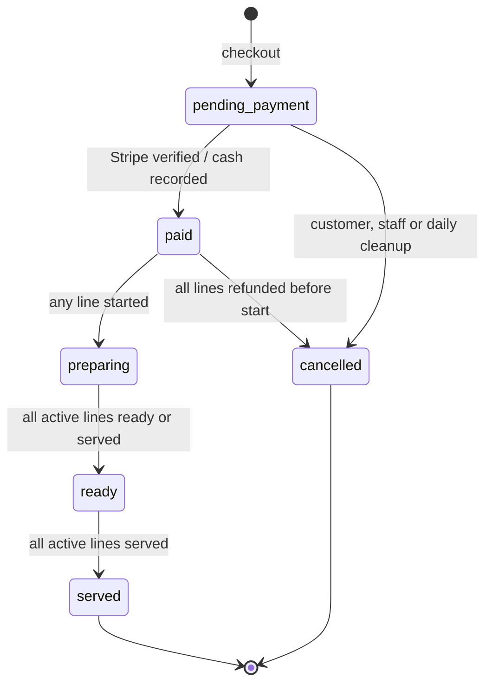
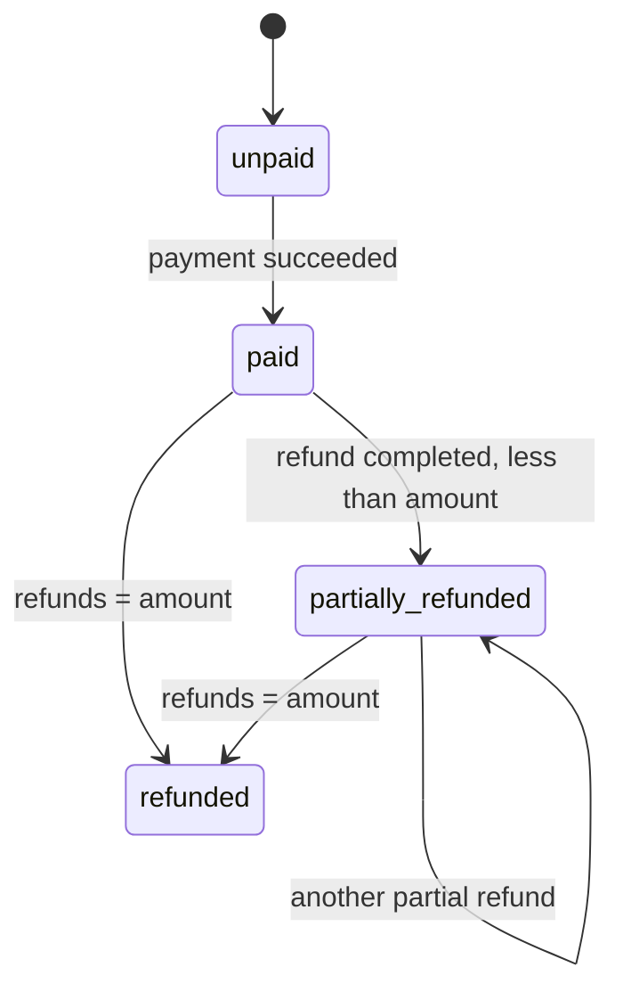
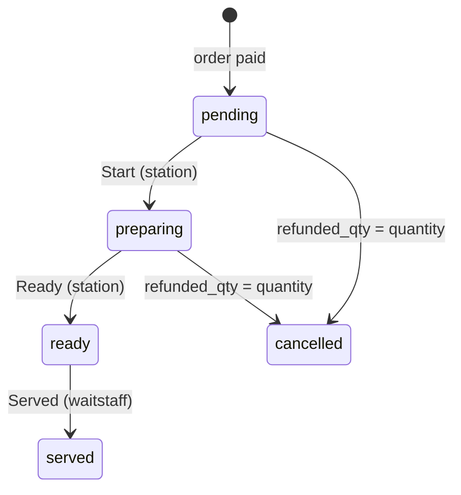
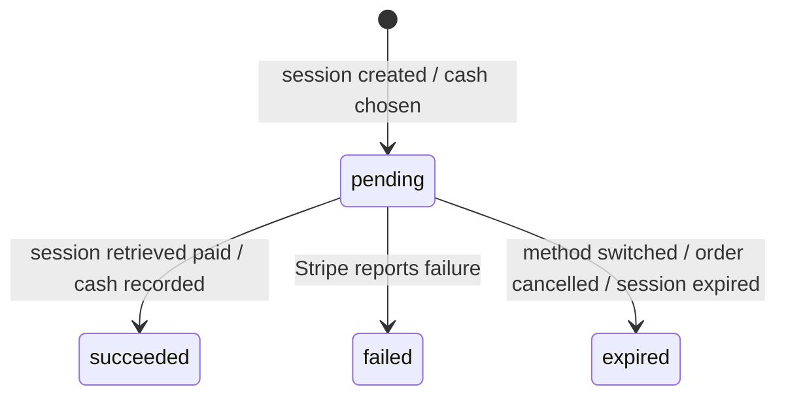
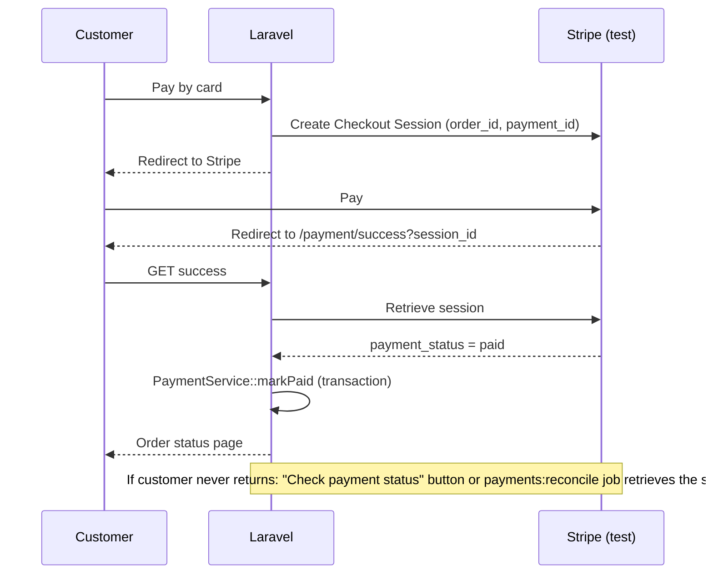
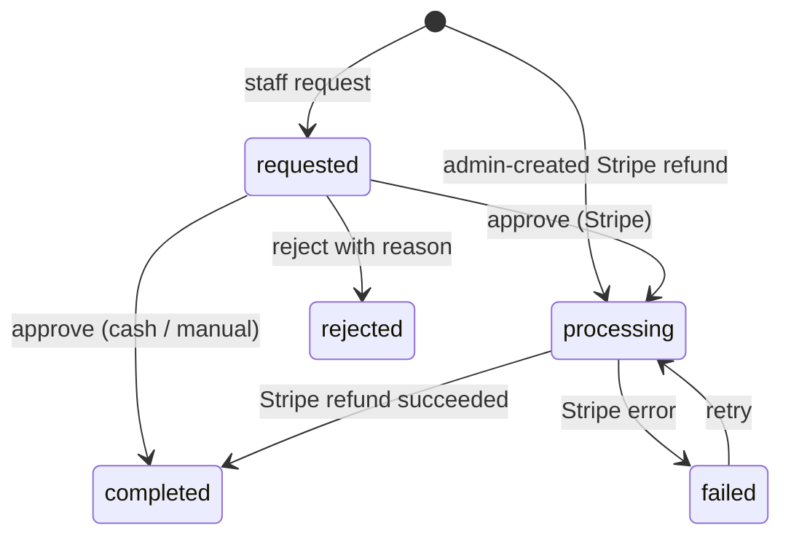
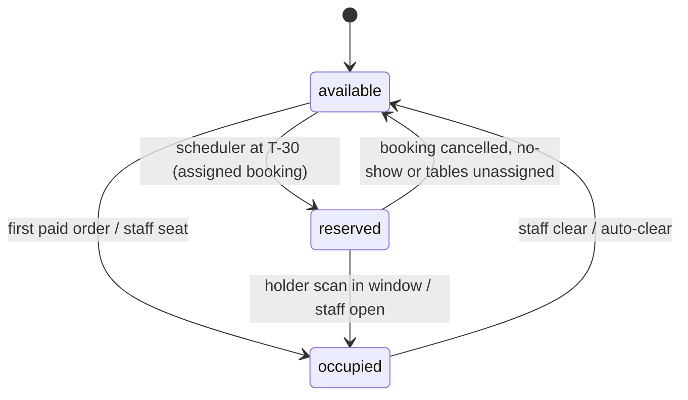
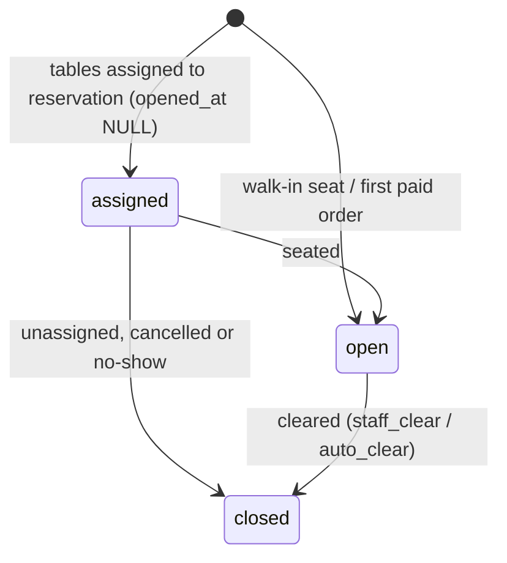
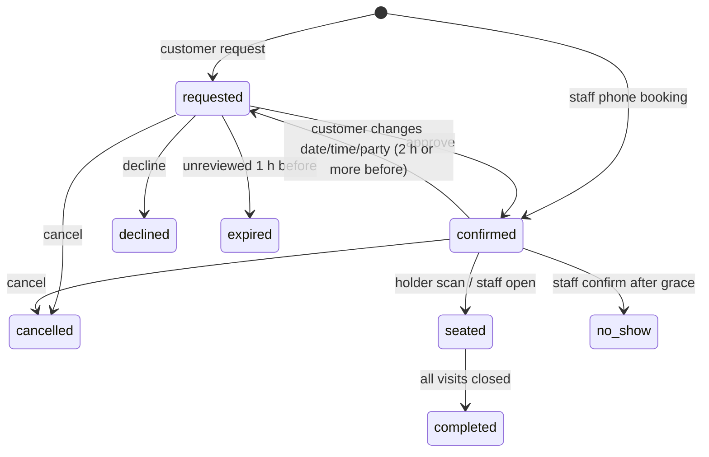

# 5. State Machines

Each status is a PHP backed enum with `canTransitionTo()`. All changes go through one service method that checks guards, sets timestamps, writes `order_status_history` / `audit_log`, and broadcasts after commit. Invalid transitions throw `InvalidTransitionException` (HTTP 409).

## 5.1 orders.status (fulfilment)

| From → To | Trigger | Actor | Guard | Side effects |
|---|---|---|---|---|
| pending_payment → paid | Stripe session paid / cash recorded | System, Waitstaff | One succeeded payment | Exact stock deduction (conflict flag if fails), lines pending on stations, ETAs, table Occupied + visit if needed, paid_at, broadcast |
| pending_payment → cancelled | Cancel / cleanup | Customer, Waitstaff, Admin, Scheduler | No succeeded payment | Expire Stripe session, cancelled_at |
| paid → preparing | Line started | Derived | — | started_at |
| preparing → ready | Lines ready | Derived | — | ready_at, floor alert |
| ready → served | Lines served | Derived | — | served_at, feedback unlocked (QR orders) |
| paid → cancelled | Full refund completed | System | No line preparing | Lines cancelled |

## 5.2 orders.payment_status

## 5.3 order_item.status (station line)

Lines of the same order and destination move together when staff press Start / Ready / Served.

## 5.4 payment.status (one row per attempt)

Stripe verification sequence:

## 5.5 refund.status

On completion: refunded_qty updated, payment_status recalculated, stock returned only if return_to_stock = 1.

## 5.6 restaurant_table.status

Admin override: any → any with reason. Inactive tables are excluded from all transitions.

## 5.7 visit lifecycle

## 5.8 reservation.status

