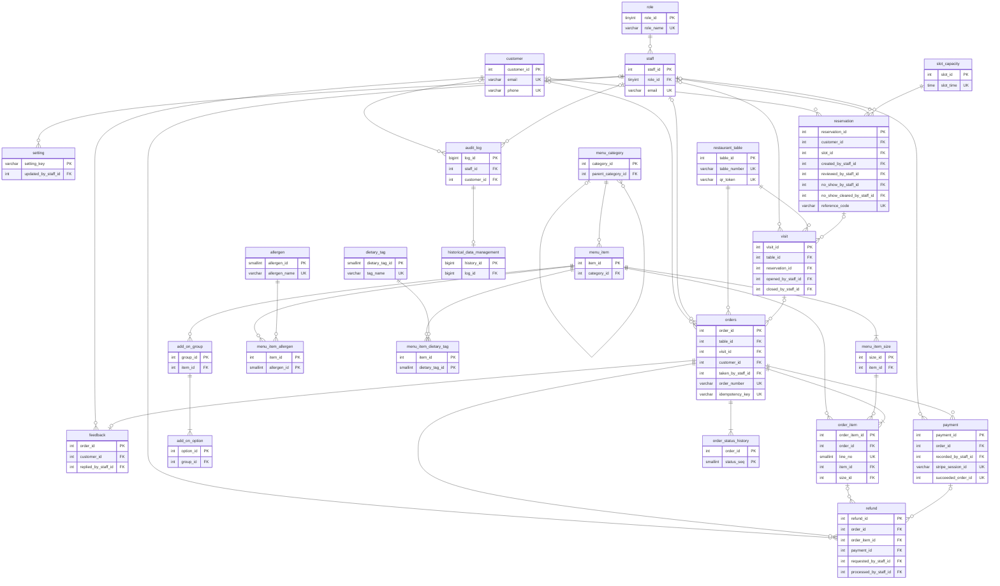

# 6. Data Design

## 6.1 Conventions
| Item | Convention |
|---|---|
| Database | MySQL 8, InnoDB, utf8mb4_unicode_ci |
| Names | Approved ERD table names (singular; `orders` plural because ORDER is reserved) |
| Keys | PK primary · FK foreign · PF primary + foreign · UK unique. Surrogate keys are unsigned auto-increment |
| Money | decimal(8,2), AUD, GST-inclusive |
| Time | datetime, Australia/Melbourne |
| Enums | varchar validated by PHP backed enums (6.3) |
| Deletes | ON DELETE RESTRICT unless stated; archive/deactivate instead of delete |
| Framework tables | `sessions`, `password_reset_tokens`, `jobs`/`failed_jobs` and `cache` (local drivers) are Laravel infrastructure, not design entities. Delete the default `users` migration. |

## 6.2 Entity relationship diagram
Authoritative visual: `docs/erd/Coolaroo_RMS_ERD_v2.drawio` (25 entities, 36 relationships). Keys-only view:

## 6.3 Enumerated values
| Column | Allowed values | Notes |
|---|---|---|
| role.role_name | admin, waitstaff, kitchen, bar | Seeded. Customers are not roles. |
| restaurant_table.status | available, reserved, occupied | Table state machine. reserved set only by T-30 scheduler job (BR04). |
| menu_item.destination, order_item.destination | kitchen, bar | Station routing (FR55). |
| visit.close_reason | staff_clear, auto_clear, no_show, cancelled, unassigned, override | Why a visit row was closed. |
| reservation.status | requested, confirmed, declined, expired, cancelled, seated, completed, no_show | Reservation state machine. |
| reservation.cancelled_by | customer, staff |  |
| orders.status | pending_payment, paid, preparing, ready, served, cancelled | Fulfilment state machine. preparing/ready/served derived from order_item lines (BR28). |
| orders.payment_status | unpaid, paid, partially_refunded, refunded | Money state, separate from fulfilment. |
| order_item.status | pending, preparing, ready, served, cancelled | Line progress at its station (BR28). |
| order_status_history.event_source | customer, waitstaff, kitchen, bar, admin, stripe, system | Who or what caused the change (stripe = verified session retrieval). |
| payment.method | stripe, cash |  |
| payment.status | pending, succeeded, failed, expired | One row per attempt. |
| payment.adjustment_category | complaint, staff_meal, manager_comp, other | Required when adjustment_amount > 0 (BR23). |
| refund.method | stripe, cash, manual | manual = EFTPOS terminal, bank transfer etc. with manual_reference. |
| refund.status | requested, processing, completed, failed, rejected | processing used for Stripe only. |
| setting.value_type | int, decimal, bool, time, string | How setting_value is cast. |
| historical_data_management.status | archived, restored |  |

## 6.4 Tables

### 6.4.1 `role`
Staff roles used for access control and landing screen.

| Column | Type | Null | Default | Key | Description and rules |
|---|---|---|---|---|---|
| role_id | tinyint unsigned | NO | auto | PK |  |
| role_name | varchar(20) | NO |  | UK | admin, waitstaff, kitchen, bar. |
| description | varchar(150) | YES | NULL |  |  |
| landing_screen | varchar(50) | NO |  |  | Route name opened after login, e.g. admin.dashboard, floor.index, kds.kitchen. |

**Indexes and constraints**
- UNIQUE (role_name)

### 6.4.2 `staff`
Staff accounts created by Admin (FR02). Separate Laravel auth guard 'staff'.

| Column | Type | Null | Default | Key | Description and rules |
|---|---|---|---|---|---|
| staff_id | int unsigned | NO | auto | PK |  |
| role_id | tinyint unsigned | NO |  | FK | role.role_id. ON DELETE RESTRICT. |
| email | varchar(150) | NO |  | UK | Login identifier. |
| password_hash | varchar(255) | NO |  |  | bcrypt/Argon2 (NFR05). |
| full_name | varchar(100) | NO |  |  |  |
| phone | varchar(20) | YES | NULL |  |  |
| is_active | boolean | NO | 1 |  | 0 = deactivated (FR08). Login refused. |
| remember_token | varchar(100) | YES | NULL |  | Laravel 'remember me'. |
| last_login_at | datetime | YES | NULL |  |  |
| created_at | datetime | NO | CURRENT_TIMESTAMP |  |  |

**Indexes and constraints**
- UNIQUE (email)
- INDEX (role_id, is_active)
- Rule: cannot deactivate self or last active admin (enforced in service).

### 6.4.3 `customer`
Customer accounts (FR01). Auth guard 'customer'. Required for QR ordering, reservations, feedback and AI.

| Column | Type | Null | Default | Key | Description and rules |
|---|---|---|---|---|---|
| customer_id | int unsigned | NO | auto | PK |  |
| email | varchar(150) | NO |  | UK |  |
| password_hash | varchar(255) | NO |  |  |  |
| full_name | varchar(100) | NO |  |  | Shown to other customers as first name + last initial (BR41). |
| phone | varchar(20) | YES | NULL | UK | Unique when present (BR52). Required before reservation request (BR42). |
| email_verified_at | datetime | YES | NULL |  | NULL = unverified. Required for reservations (BR42). |
| is_active | boolean | NO | 1 |  |  |
| remember_token | varchar(100) | YES | NULL |  |  |
| last_login_at | datetime | YES | NULL |  |  |
| created_at | datetime | NO | CURRENT_TIMESTAMP |  | 'Member since' on trust profile. |

**Indexes and constraints**
- UNIQUE (email)
- UNIQUE (phone) — MySQL allows multiple NULLs
- Trust badge (BR40) is calculated from reservation and orders, not stored.

### 6.4.4 `setting`
Admin-editable venue settings (FR91). One row per key; seeded with defaults (Section 5).

| Column | Type | Null | Default | Key | Description and rules |
|---|---|---|---|---|---|
| setting_key | varchar(60) | NO |  | PK | e.g. table_idle_autoclear_minutes. |
| setting_value | varchar(255) | NO |  |  | Stored as text, cast by value_type. |
| value_type | varchar(10) | NO | 'string' |  | Enum, see Section 3. |
| description | varchar(255) | YES | NULL |  | Help text on settings screen. |
| updated_by_staff_id | int unsigned | YES | NULL | FK | staff.staff_id. ON DELETE SET NULL. |
| updated_at | datetime | YES | NULL |  |  |

**Indexes and constraints**
- Values cached; cache cleared on update.

### 6.4.5 `restaurant_table`
Physical tables, their QR code and live status (FR11–FR21).

| Column | Type | Null | Default | Key | Description and rules |
|---|---|---|---|---|---|
| table_id | int unsigned | NO | auto | PK |  |
| table_number | varchar(10) | NO |  | UK | Printed number, e.g. T12. |
| seat_capacity | tinyint unsigned | NO |  |  | Must be > 0. Used for reservation assignment (BR33). |
| section | varchar(20) | YES | NULL |  | Floor area label for grouping on floor view, e.g. Dining, Bar, Outdoor. |
| qr_token | varchar(64) | NO |  | UK | Random token in the signed QR URL (NFR04). Regenerating invalidates old QR (FR14). |
| status | varchar(10) | NO | 'available' |  | Enum available, reserved, occupied. |
| status_changed_at | datetime | YES | NULL |  | Updated on every status change. |
| is_active | boolean | NO | 1 |  | 0 = QR shows 'table unavailable' (BR07). |
| created_at | datetime | NO | CURRENT_TIMESTAMP |  |  |

**Indexes and constraints**
- UNIQUE (table_number)
- UNIQUE (qr_token)
- INDEX (status, is_active)
- Status changes are written to audit_log (action table_status).

### 6.4.6 `slot_capacity`
Bookable reservation times and online seat capacity per time window (BR32, BR33).

| Column | Type | Null | Default | Key | Description and rules |
|---|---|---|---|---|---|
| slot_id | int unsigned | NO | auto | PK |  |
| slot_time | time | NO |  | UK | Start time, e.g. 18:00. Slots also define online booking hours. |
| max_covers | smallint unsigned | NO |  |  | Maximum guests across requested + confirmed bookings starting in this slot. |
| is_active | boolean | NO | 1 |  | 0 = not bookable online. |

**Indexes and constraints**
- UNIQUE (slot_time)

### 6.4.7 `menu_category`
Menu categories with one optional subcategory level (A4).

| Column | Type | Null | Default | Key | Description and rules |
|---|---|---|---|---|---|
| category_id | int unsigned | NO | auto | PK |  |
| parent_category_id | int unsigned | YES | NULL | FK | Self reference. NULL = top level. Parent must itself be top level. ON DELETE RESTRICT. |
| category_name | varchar(60) | NO |  |  |  |
| display_order | smallint unsigned | NO | 0 |  |  |
| is_active | boolean | NO | 1 |  |  |

**Indexes and constraints**
- INDEX (parent_category_id, display_order)
- Cannot delete a category that has items or children.

### 6.4.8 `menu_item`
Menu items. Price lives in menu_item_size.

| Column | Type | Null | Default | Key | Description and rules |
|---|---|---|---|---|---|
| item_id | int unsigned | NO | auto | PK |  |
| category_id | int unsigned | NO |  | FK | menu_category. ON DELETE RESTRICT. |
| item_name | varchar(100) | NO |  |  |  |
| description | varchar(500) | YES | NULL |  |  |
| image_path | varchar(255) | YES | NULL |  | Relative path in storage/app/public/menu. |
| destination | varchar(10) | NO |  |  | Enum kitchen, bar. Station routing. |
| prep_minutes | tinyint unsigned | NO | 10 |  | Used in station ETA (BR30). |
| is_available | boolean | NO | 1 |  | Sold-out toggle (FR29). Admin, or Kitchen/Bar for own station. |
| is_featured | boolean | NO | 0 |  | 1 = shown in homepage menu section (max 12). |
| daily_limit | smallint unsigned | YES | NULL |  | NULL = unlimited. Shared across sizes (BR10). |
| sold_today | smallint unsigned | NO | 0 |  | Incremented atomically at payment (BR10); reset at opening (BR11). QR checkout needs daily_limit − sold_today ≥ buffer × qty (BR09). |
| is_active | boolean | NO | 1 |  | 0 = archived (FR25). |
| calories_kcal | decimal(7,2) | YES | NULL |  |  |
| protein_g | decimal(6,2) | YES | NULL |  |  |
| carbohydrates_g | decimal(6,2) | YES | NULL |  |  |
| fat_g | decimal(6,2) | YES | NULL |  |  |
| created_at | datetime | NO | CURRENT_TIMESTAMP |  |  |
| updated_at | datetime | YES | NULL |  |  |

**Indexes and constraints**
- INDEX (category_id, is_active, is_available)
- CHECK (daily_limit IS NULL OR sold_today <= daily_limit) not enforced — conflicts handled by has_stock_conflict (BR54).
- INDEX (is_featured, is_active)

### 6.4.9 `menu_item_size`
Sizes and prices for an item. Every item has at least one size (FR26).

| Column | Type | Null | Default | Key | Description and rules |
|---|---|---|---|---|---|
| size_id | int unsigned | NO | auto | PK |  |
| item_id | int unsigned | NO |  | FK | menu_item. ON DELETE CASCADE. |
| size_name | varchar(40) | NO | 'Regular' |  | Hidden on menu when item has one size. |
| price | decimal(8,2) | NO |  |  | AUD, GST-inclusive (BR19). > 0. |
| sale_price | decimal(8,2) | YES | NULL |  | Must be < price. |
| sale_starts_at | datetime | YES | NULL |  | NULL = from now. |
| sale_ends_at | datetime | YES | NULL |  | NULL = no end. Sale applies only inside window (BR20). |
| display_order | smallint unsigned | NO | 0 |  |  |
| is_active | boolean | NO | 1 |  |  |

**Indexes and constraints**
- UNIQUE (item_id, size_name)
- INDEX (item_id, is_active)

### 6.4.10 `add_on_group`
Add-on group belonging to one menu item (not reusable).

| Column | Type | Null | Default | Key | Description and rules |
|---|---|---|---|---|---|
| group_id | int unsigned | NO | auto | PK |  |
| item_id | int unsigned | NO |  | FK | menu_item. ON DELETE CASCADE. |
| group_name | varchar(60) | NO |  |  | e.g. Sauce, Extras. |
| is_required | boolean | NO | 0 |  | If 1, min_select ≥ 1. |
| min_select | tinyint unsigned | NO | 0 |  |  |
| max_select | tinyint unsigned | NO | 1 |  | ≥ min_select (BR16). |
| display_order | smallint unsigned | NO | 0 |  |  |

**Indexes and constraints**
- INDEX (item_id, display_order)

### 6.4.11 `add_on_option`
Choices inside an add-on group.

| Column | Type | Null | Default | Key | Description and rules |
|---|---|---|---|---|---|
| option_id | int unsigned | NO | auto | PK |  |
| group_id | int unsigned | NO |  | FK | add_on_group. ON DELETE CASCADE. |
| option_name | varchar(60) | NO |  |  | e.g. Bacon. |
| price_delta | decimal(8,2) | NO | 0.00 |  | Added to size price; 0 allowed. Always full price (BR20). |
| is_available | boolean | NO | 1 |  | Sold-out toggle (FR29). |
| is_active | boolean | NO | 1 |  |  |
| display_order | smallint unsigned | NO | 0 |  |  |

**Indexes and constraints**
- INDEX (group_id, is_active)
- Allergens of options must be included in the parent item's allergen tags.

### 6.4.12 `allergen`
Allergen reference list.

| Column | Type | Null | Default | Key | Description and rules |
|---|---|---|---|---|---|
| allergen_id | smallint unsigned | NO | auto | PK |  |
| allergen_name | varchar(50) | NO |  | UK | e.g. Peanuts, Dairy, Gluten. |
| description | varchar(255) | YES | NULL |  |  |
| is_active | boolean | NO | 1 |  |  |

**Indexes and constraints**
- UNIQUE (allergen_name)

### 6.4.13 `menu_item_allergen`
Weak entity. Allergens present in an item, including its add-ons.

| Column | Type | Null | Default | Key | Description and rules |
|---|---|---|---|---|---|
| item_id | int unsigned | NO |  | PF | menu_item. ON DELETE CASCADE. |
| allergen_id | smallint unsigned | NO |  | PF | allergen. ON DELETE RESTRICT. |

**Indexes and constraints**
- PRIMARY KEY (item_id, allergen_id)
- INDEX (allergen_id)

### 6.4.14 `dietary_tag`
Dietary tag reference list.

| Column | Type | Null | Default | Key | Description and rules |
|---|---|---|---|---|---|
| dietary_tag_id | smallint unsigned | NO | auto | PK |  |
| tag_name | varchar(30) | NO |  | UK | e.g. Vegetarian, Halal. |
| description | varchar(255) | YES | NULL |  |  |
| is_active | boolean | NO | 1 |  |  |

**Indexes and constraints**
- UNIQUE (tag_name)

### 6.4.15 `menu_item_dietary_tag`
Weak entity. Dietary tags for an item.

| Column | Type | Null | Default | Key | Description and rules |
|---|---|---|---|---|---|
| item_id | int unsigned | NO |  | PF | menu_item. ON DELETE CASCADE. |
| dietary_tag_id | smallint unsigned | NO |  | PF | dietary_tag. ON DELETE RESTRICT. |

**Indexes and constraints**
- PRIMARY KEY (item_id, dietary_tag_id)
- INDEX (dietary_tag_id)

### 6.4.16 `visit`
One row per table per occupancy or reservation assignment. Replaces table sessions and reservation-table links.

| Column | Type | Null | Default | Key | Description and rules |
|---|---|---|---|---|---|
| visit_id | int unsigned | NO | auto | PK |  |
| table_id | int unsigned | NO |  | FK | restaurant_table. ON DELETE RESTRICT. |
| reservation_id | int unsigned | YES | NULL | FK | reservation. NULL = walk-in or QR occupancy. ON DELETE SET NULL. |
| opened_by_staff_id | int unsigned | YES | NULL | FK | staff. NULL when opened by paid order or holder scan. |
| closed_by_staff_id | int unsigned | YES | NULL | FK | staff. NULL when closed by system. |
| guest_count | tinyint unsigned | YES | NULL |  | Party size for reservations; optional for walk-ins. |
| opened_at | datetime | YES | NULL |  | NULL = assigned to a reservation, not yet occupied (BR04). Set when table becomes Occupied. |
| closed_at | datetime | YES | NULL |  | Set when cleared or assignment removed. |
| close_reason | varchar(20) | YES | NULL |  | Enum staff_clear, auto_clear, no_show, cancelled, unassigned, override. |
| created_at | datetime | NO | CURRENT_TIMESTAMP |  | Assignment or opening time. |

**Indexes and constraints**
- INDEX (table_id, closed_at) — find open visit of a table
- INDEX (reservation_id)
- Rule: at most one visit with opened_at NOT NULL and closed_at NULL per table (enforced in service with row lock).
- Reservation becomes completed when all its visits are closed (BR55).

### 6.4.17 `reservation`
Reservation requests and bookings (FR61–FR72).

| Column | Type | Null | Default | Key | Description and rules |
|---|---|---|---|---|---|
| reservation_id | int unsigned | NO | auto | PK |  |
| customer_id | int unsigned | YES | NULL | FK | customer. NULL for guest phone bookings (A5). ON DELETE RESTRICT. |
| slot_id | int unsigned | NO |  | FK | slot_capacity. ON DELETE RESTRICT. |
| created_by_staff_id | int unsigned | YES | NULL | FK | staff. Set for phone bookings (FR64). |
| reviewed_by_staff_id | int unsigned | YES | NULL | FK | staff who approved or declined. |
| no_show_by_staff_id | int unsigned | YES | NULL | FK | staff who confirmed no-show. |
| no_show_cleared_by_staff_id | int unsigned | YES | NULL | FK | admin who cleared flag (FR10). |
| reference_code | varchar(16) | NO |  | UK | Shown to customer, e.g. CR-7K2P9Q. |
| guest_name | varchar(100) | YES | NULL |  | Required when customer_id is NULL. |
| guest_phone | varchar(20) | YES | NULL |  | Required when customer_id is NULL. |
| booking_date | date | NO |  |  |  |
| booking_time | time | NO |  |  | Copied from slot_time at booking. |
| party_size | tinyint unsigned | NO |  |  | ≤ online max party size for customer requests (BR35). |
| special_requests | varchar(500) | YES | NULL |  | Editable anytime by customer. |
| status | varchar(15) | NO | 'requested' |  | Enum, see Section 3. Staff bookings start at confirmed. |
| decline_reason | varchar(255) | YES | NULL |  |  |
| reviewed_at | datetime | YES | NULL |  |  |
| seated_at | datetime | YES | NULL |  |  |
| completed_at | datetime | YES | NULL |  |  |
| cancelled_at | datetime | YES | NULL |  |  |
| cancelled_by | varchar(10) | YES | NULL |  | Enum customer, staff. |
| is_late_cancellation | boolean | NO | 0 |  | 1 if cancelled < 2 h before booking (BR38). |
| no_show_at | datetime | YES | NULL |  | Counts toward Flagged badge for 12 months (BR40). |
| no_show_cleared_at | datetime | YES | NULL |  | Cleared no-shows are excluded from badge. |
| no_show_clear_reason | varchar(255) | YES | NULL |  | Required when cleared. |
| reminder_sent_at | datetime | YES | NULL |  | Prevents duplicate reminders (FR75). |
| created_at | datetime | NO | CURRENT_TIMESTAMP |  |  |
| updated_at | datetime | YES | NULL |  |  |

**Indexes and constraints**
- UNIQUE (reference_code)
- INDEX (booking_date, status)
- INDEX (customer_id, status)
- INDEX (slot_id, booking_date)
- Customer date/time/party changes blocked < 2 h before booking (BR36).

### 6.4.18 `orders`
Customer QR orders and staff-taken orders. Named 'orders' because ORDER is reserved in SQL.

| Column | Type | Null | Default | Key | Description and rules |
|---|---|---|---|---|---|
| order_id | int unsigned | NO | auto | PK |  |
| table_id | int unsigned | NO |  | FK | restaurant_table. ON DELETE RESTRICT. |
| visit_id | int unsigned | YES | NULL | FK | visit. Set at payment to the table's open visit (created if none). |
| customer_id | int unsigned | YES | NULL | FK | customer. NULL for staff-taken orders (BR53). |
| taken_by_staff_id | int unsigned | YES | NULL | FK | staff. Set for staff-taken orders (FR42). |
| order_number | varchar(12) | NO |  | UK | Human reference, e.g. 20260916-042. |
| idempotency_key | varchar(64) | NO |  | UK | Blocks duplicate checkout submissions. |
| status | varchar(15) | NO | 'pending_payment' |  | Enum, see Section 3. |
| payment_status | varchar(20) | NO | 'unpaid' |  | Enum, see Section 3. |
| total_amount | decimal(8,2) | NO |  |  | Sum of order_item.line_total, GST-inclusive (BR21). |
| gst_amount | decimal(8,2) | NO |  |  | total_amount / 11, rounded to cents (BR19). |
| has_stock_conflict | boolean | NO | 0 |  | 1 if exact stock check failed at payment (BR54); cleared by Resolve Stock Conflict (FR94). |
| kitchen_eta_at | datetime | YES | NULL |  | Estimated ready time for kitchen lines (BR30). NULL if none. |
| bar_eta_at | datetime | YES | NULL |  | Estimated ready time for bar lines. |
| placed_at | datetime | NO | CURRENT_TIMESTAMP |  | Checkout time. |
| paid_at | datetime | YES | NULL |  |  |
| started_at | datetime | YES | NULL |  | First line started preparing. |
| ready_at | datetime | YES | NULL |  |  |
| served_at | datetime | YES | NULL |  |  |
| cancelled_at | datetime | YES | NULL |  |  |

**Indexes and constraints**
- UNIQUE (order_number)
- UNIQUE (idempotency_key)
- INDEX (status, placed_at)
- INDEX (table_id, status)
- INDEX (customer_id, placed_at)
- INDEX (paid_at) — reports
- Unpaid orders cancelled by daily reset job (BR26).

### 6.4.19 `order_item`
Order lines with price snapshots. Surrogate PK; (order_id, line_no) unique.

| Column | Type | Null | Default | Key | Description and rules |
|---|---|---|---|---|---|
| order_item_id | int unsigned | NO | auto | PK |  |
| order_id | int unsigned | NO |  | FK | orders. ON DELETE CASCADE. |
| line_no | smallint unsigned | NO |  | UK | 1, 2, 3… within order. |
| item_id | int unsigned | NO |  | FK | menu_item. ON DELETE RESTRICT. |
| size_id | int unsigned | NO |  | FK | menu_item_size. ON DELETE RESTRICT. |
| item_name | varchar(100) | NO |  |  | Snapshot (BR15). |
| size_name | varchar(40) | NO |  |  | Snapshot. |
| destination | varchar(10) | NO |  |  | Snapshot of station: kitchen, bar. |
| quantity | tinyint unsigned | NO |  |  | ≥ 1. |
| original_unit_price | decimal(8,2) | NO |  |  | Size price before sale. |
| unit_price | decimal(8,2) | NO |  |  | Charged size price (sale applied). |
| selected_options | json | YES | NULL |  | Snapshot array: [{group, option_id, name, price}] (BR15, BR16). |
| special_request | varchar(200) | YES | NULL |  | BR17. |
| line_total | decimal(8,2) | NO |  |  | (unit_price + sum of option prices) × quantity (BR21). |
| status | varchar(15) | NO | 'pending' |  | Enum, see Section 3. Lines of the same destination move together on KDS. |
| prepared_at | datetime | YES | NULL |  | Set when line marked ready. |
| refunded_qty | tinyint unsigned | NO | 0 |  | Sum of completed refunds. ≤ quantity. |

**Indexes and constraints**
- UNIQUE (order_id, line_no)
- INDEX (destination, status) — station queues
- INDEX (item_id) — item reports

### 6.4.20 `order_status_history`
Weak entity. Timeline of order status changes (FR38).

| Column | Type | Null | Default | Key | Description and rules |
|---|---|---|---|---|---|
| order_id | int unsigned | NO |  | PF | orders. ON DELETE CASCADE. |
| status_seq | smallint unsigned | NO |  | PK | 1, 2, 3… within order. |
| status | varchar(20) | NO |  |  | orders.status or payment_status value reached. |
| occurred_at | datetime | NO | CURRENT_TIMESTAMP |  |  |
| event_source | varchar(50) | NO |  |  | Enum, see Section 3. |

**Indexes and constraints**
- PRIMARY KEY (order_id, status_seq)
- Insert-only.

### 6.4.21 `payment`
Payment attempts. Many per order; at most one succeeded.

| Column | Type | Null | Default | Key | Description and rules |
|---|---|---|---|---|---|
| payment_id | int unsigned | NO | auto | PK |  |
| order_id | int unsigned | NO |  | FK | orders. ON DELETE RESTRICT. |
| recorded_by_staff_id | int unsigned | YES | NULL | FK | staff for cash. NULL for Stripe. |
| method | varchar(10) | NO |  |  | Enum stripe, cash. |
| amount | decimal(8,2) | NO |  |  | Amount due for this attempt (cash: after rounding and adjustment). |
| stripe_session_id | varchar(100) | YES | NULL | UK | Stripe Checkout Session ID. |
| provider_payment_id | varchar(100) | YES | NULL |  | Stripe PaymentIntent ID; used for refunds. |
| amount_received | decimal(8,2) | YES | NULL |  | Cash tendered. |
| change_given | decimal(8,2) | YES | NULL |  | amount_received − amount. |
| rounding_amount | decimal(8,2) | NO | 0.00 |  | Cash 5c rounding, ± (BR22). |
| adjustment_amount | decimal(8,2) | NO | 0.00 |  | Cash discount given by staff (BR23). |
| adjustment_category | varchar(30) | YES | NULL |  | Required if adjustment_amount > 0. |
| adjustment_note | varchar(255) | YES | NULL |  | Required if adjustment_amount > 0. |
| status | varchar(15) | NO | 'pending' |  | pending, succeeded, failed, expired. succeeded set only after Stripe session retrieval or cash record. |
| succeeded_order_id | int unsigned | YES | generated | UK | STORED generated column: IF(status='succeeded', order_id, NULL). Unique → one succeeded payment per order (BR25). |
| paid_at | datetime | YES | NULL |  |  |
| created_at | datetime | NO | CURRENT_TIMESTAMP |  |  |

**Indexes and constraints**
- UNIQUE (stripe_session_id)
- UNIQUE (succeeded_order_id)
- INDEX (order_id, status)
- INDEX (method, paid_at) — cash reports
- Stripe verification is idempotent on stripe_session_id (BR25).

### 6.4.22 `refund`
Refunds, one row per order line (FR51, FR52).

| Column | Type | Null | Default | Key | Description and rules |
|---|---|---|---|---|---|
| refund_id | int unsigned | NO | auto | PK |  |
| order_id | int unsigned | NO |  | FK | orders. ON DELETE RESTRICT. |
| order_item_id | int unsigned | YES | NULL | FK | order_item. NULL = amount-only refund not tied to a line. |
| payment_id | int unsigned | YES | NULL | FK | payment refunded. Required for method stripe. |
| requested_by_staff_id | int unsigned | NO |  | FK | staff (Waitstaff, Kitchen, Bar or Admin). Customers cannot request (BR27). |
| processed_by_staff_id | int unsigned | YES | NULL | FK | Admin who approved, rejected or recorded. |
| method | varchar(10) | NO |  |  | Enum stripe, cash, manual. |
| quantity | tinyint unsigned | NO | 0 |  | Units of the line refunded; 0 for amount-only. |
| amount | decimal(8,2) | NO |  |  | > 0. Total refunds ≤ succeeded payment amount (BR27). |
| reason | varchar(255) | NO |  |  |  |
| status | varchar(15) | NO | 'requested' |  | Enum, see Section 3. |
| return_to_stock | boolean | NO | 0 |  | Admin choice on completion; if 1, sold_today reduced by quantity (BR13). |
| provider_refund_id | varchar(100) | YES | NULL |  | Stripe Refund ID. |
| manual_reference | varchar(100) | YES | NULL |  | Required for manual method. |
| rejection_reason | varchar(255) | YES | NULL |  | Required when rejected. |
| requested_at | datetime | NO | CURRENT_TIMESTAMP |  |  |
| completed_at | datetime | YES | NULL |  | On completion: order_item.refunded_qty and orders.payment_status recalculated. |

**Indexes and constraints**
- INDEX (status, requested_at) — admin queue
- INDEX (order_id)
- UNIQUE (provider_refund_id)

### 6.4.23 `feedback`
Weak entity. One feedback per served, paid QR order (BR43).

| Column | Type | Null | Default | Key | Description and rules |
|---|---|---|---|---|---|
| order_id | int unsigned | NO |  | PF | orders. ON DELETE CASCADE. |
| customer_id | int unsigned | NO |  | FK | customer. Must equal orders.customer_id. |
| replied_by_staff_id | int unsigned | YES | NULL | FK | staff (admin). |
| food_rating | tinyint unsigned | NO |  |  | 1–5. |
| service_rating | tinyint unsigned | NO |  |  | 1–5. |
| comment | varchar(1000) | YES | NULL |  | Never edited by admin (BR44). |
| is_hidden | boolean | NO | 0 |  | Excluded from public average. |
| hidden_reason | varchar(255) | YES | NULL |  | Required when hidden. |
| is_featured | boolean | NO | 0 |  | Only if is_hidden = 0 (BR45). |
| admin_reply | varchar(1000) | YES | NULL |  |  |
| replied_at | datetime | YES | NULL |  |  |
| submitted_at | datetime | NO | CURRENT_TIMESTAMP |  |  |

**Indexes and constraints**
- PRIMARY KEY (order_id)
- INDEX (is_hidden, is_featured)
- INDEX (submitted_at)
- CHECK (food_rating BETWEEN 1 AND 5 AND service_rating BETWEEN 1 AND 5)

### 6.4.24 `audit_log`
Append-only record of significant actions (FR89, NFR14). Also stores AI usage (action ai_request).

| Column | Type | Null | Default | Key | Description and rules |
|---|---|---|---|---|---|
| log_id | bigint unsigned | NO | auto | PK |  |
| staff_id | int unsigned | YES | NULL | FK | staff actor. ON DELETE RESTRICT. |
| customer_id | int unsigned | YES | NULL | FK | customer actor. Both NULL = system. |
| action_type | varchar(50) | NO |  |  | e.g. login, menu_update, availability_toggle, table_status, order_cancel, stock_conflict_resolve, payment_cash, refund_complete, reservation_approve, table_unassign, no_show, flag_clear, feedback_hide, setting_update, ai_request. |
| entity_name | varchar(50) | NO |  |  | Table name affected. |
| entity_id | int unsigned | YES | NULL |  | Primary key of affected row (NULL for composite keys; see details). |
| details | json | YES | NULL |  | {before:{…}, after:{…}, reason} or AI {feature, tokens_in, tokens_out, cost}. |
| ip_address | varchar(45) | YES | NULL |  | IPv4 or IPv6. |
| logged_at | datetime | NO | CURRENT_TIMESTAMP |  |  |

**Indexes and constraints**
- INDEX (entity_name, entity_id)
- INDEX (action_type, logged_at)
- INDEX (staff_id, logged_at)
- No UPDATE or DELETE in application.

### 6.4.25 `historical_data_management`
Archive of record snapshots taken from audit events (unchanged from approved ERD).

| Column | Type | Null | Default | Key | Description and rules |
|---|---|---|---|---|---|
| history_id | bigint unsigned | NO | auto | PK |  |
| log_id | bigint unsigned | NO |  | FK | audit_log. ON DELETE RESTRICT. |
| entity_name | varchar(50) | NO |  |  |  |
| record_id | varchar(100) | NO |  |  | Key of archived record (supports composite as text). |
| record_data | text | NO |  |  | Full JSON snapshot of the record. |
| status | varchar(20) | NO | 'archived' |  | Enum archived, restored. |
| archived_at | datetime | NO | CURRENT_TIMESTAMP |  |  |

**Indexes and constraints**
- UNIQUE (log_id)
- INDEX (entity_name, record_id)

## 6.5 Settings seed
| setting_key | value_type | Default | Used by |
|---|---|---|---|
| opening_time | time | 11:00 | Daily stock reset (BR11) |
| closing_time | time | 23:00 | Unpaid order cleanup (BR26) |
| qr_stock_buffer_multiplier | int | 5 | QR checkout stock check |
| reservation_min_lead_hours | int | 2 | BR35 |
| reservation_max_party_online | int | 10 | BR35 |
| reservation_duration_1_2 | int | 90 | Minutes, BR34 |
| reservation_duration_3_6 | int | 120 | Minutes, BR34 |
| reservation_duration_7_plus | int | 150 | Minutes, BR34 |
| reservation_request_expiry_minutes | int | 60 | Before booking, BR37 |
| reservation_reminder_hours | int | 24 | FR75 |
| late_cancellation_hours | int | 2 | BR38; also change lock BR36 |
| holder_unlock_before_minutes | int | 15 | BR03 |
| reservation_grace_minutes | int | 15 | BR03, BR39 |
| reserved_switch_before_minutes | int | 30 | BR04 |
| unassigned_admin_alert_minutes | int | 15 | FR71 |
| no_show_expiry_months | int | 12 | BR40 |
| regular_badge_visits | int | 3 | BR40 |
| table_idle_autoclear_minutes | int | 45 | BR05 |
| avg_ticket_minutes_kitchen | int | 8 | BR30 |
| avg_ticket_minutes_bar | int | 3 | BR30 |
| public_rating_min_count | int | 10 | BR45 |
| call_waiter_cooldown_seconds | int | 120 | BR50 |
| staff_session_timeout_minutes | int | 30 | BR51 |
| closed_weekdays | string | 1 | Comma list, 1 = Monday … 7 = Sunday (BR35) |
| reservation_max_days_ahead | int | 60 | BR35 |
| venue_name | string | Coolaroo Restaurant & Bistro | Footer, emails, AI |
| venue_address | string | xxx Sydney Road, Coolaroo VIC 3048 | Footer, AI |
| venue_phone | string | (03) 9302 4453 | Footer, call-us messages |
| venue_email | string | bookings@coolaroo.com.au | Footer, emails |
| social_facebook | string |  | Footer |
| social_instagram | string |  | Footer |
| social_x | string |  | Footer |
| social_tiktok | string |  | Footer |
| social_whatsapp | string |  | Footer |
| qr_ordering_enabled | bool | 1 | BR58, FR96 |
| reservations_online_enabled | bool | 1 | BR58, FR97 |
| ai_enabled | bool | 1 | BR49, FR98 |
