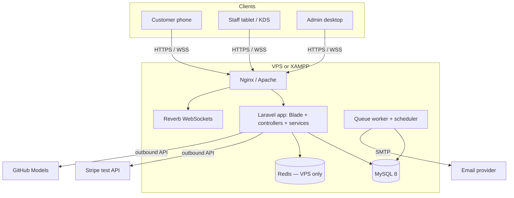

# 7. Architecture

## 7.1 Overview

**Style:** Laravel monolith, server-rendered Blade, small vanilla JS modules with Laravel Echo for live updates. No SPA framework (report requires PHP code under each screen). Laravel 11+, PHP 8.5.

## 7.2 Environments
| | Local (XAMPP) | Production (VPS) |
|---|---|---|
| Web server | Apache (XAMPP) | Nginx + PHP-FPM 8.5 |
| Database | XAMPP MySQL/MariaDB → use MySQL 8 if possible | MySQL 8 |
| PHP | 8.5 (XAMPP) | 8.5 (PHP-FPM); same minor version as local |
| Queue / cache | database | Redis |
| Sessions | database | database |
| Reverb, queue worker | Terminals | Supervisor |
| Scheduler | `php artisan schedule:work` | cron `* * * * * php artisan schedule:run` |
| Stripe | Test keys; no webhooks | Test keys; no webhooks |
| AI | GitHub Models token | GitHub Models token |
| Email | Mailpit or log | Transactional SMTP |

## 7.3 Code structure
```
app/
  Enums/          OrderStatus, PaymentStatus, OrderItemStatus, PaymentAttemptStatus, RefundStatus,
                  TableStatus, VisitCloseReason, ReservationStatus, PaymentMethod, RefundMethod, Destination
  Models/         one per table (25)
  Http/
    Controllers/  Public/ Customer/ Staff/Floor/ Staff/Kds/ Staff/ Admin/
    Middleware/   EnsureRole, EnsureTableContext, EnsureQrOrderingEnabled, EnsureEmailVerifiedForReservation, EnsureStaffSessionIsActive
    Requests/     one Form Request per write action
  Services/       see 7.4
  Policies/       OrderPolicy, ReservationPolicy, FeedbackPolicy, MenuItemPolicy
  Events/         broadcast events (7.7)
  Mail/           ReservationReceived, Confirmed, Declined, Expired, Cancelled, Reminder
  Console/Commands/ scheduled commands (7.9)
resources/views/  public/ customer/ staff/ admin/ pdf/  (pages)
  components/     document · layouts/ (public, customer, staff, admin) · site/ · dashboard/ ·
                  menu/ floor/ reservations/ kds/ staff/ (screen fragments, see 8.1) · shared UI (status-badge, stat-tile…)
resources/js/     echo.js cart.js order-status.js floor.js kds.js dashboard.js chat.js meal-builder.js
public/css/       style.css (public, W3C validated)  dashboard.css (staff/admin)
tests/            Feature/ Unit/ (Laravel)   selenium/ (end-to-end, see 09)
```

## 7.4 Services
| Service | Responsibility | Rules |
|---|---|---|
| CartService | Session cart bound to table; line validation; totals | BR16, BR17, BR20, BR21, BR57 |
| StockService | Buffer check (QR), exact check (staff), atomic deduction at payment, conflict flag, optional return | BR09–BR14, BR54 |
| CheckoutService | Revalidate cart, snapshot lines, create pending_payment order, idempotency | BR08, BR15, BR18 |
| PaymentService | markPaid(): stock, line status, visit, table Occupied, ETAs, history, broadcast; shared by Stripe and cash | BR01, BR10, BR25, BR54 |
| StripeService | Create/expire Checkout sessions, retrieve session, create/retrieve refunds (test mode) | BR24, BR25, BR26 |
| CashPaymentService | Rounding, change, adjustment validation | BR22, BR23 |
| OrderService | Customer and staff cancel of unpaid orders; resolve stock conflict | BR29, BR54, BR63 |
| RefundService | Request, approve, reject, complete, retry; refunded_qty and payment_status | BR13, BR27 |
| KitchenService | Station line transitions, order status derivation, served | BR28 |
| EtaService | Station ETA calculation and adjustment | BR30 |
| TableStatusService | Table transitions, visit open/close, audit | BR01–BR07, BR55, BR64 |
| ReservationService | Request, approve, decline, assign/unassign, seat, no-show, update locks, cancel | BR31–BR42, BR55, BR64 |
| AvailabilityService | Slots, capacity, closed weekdays, lead time, max days, online switch | BR32–BR35, BR58 |
| TrustService | Badge on read | BR40 |
| AiMenuService | Build context, call GitHub Models, validate IDs, totals, busy handling | BR46–BR49 |
| SpecialsService | Active sale detection, Specials list, homepage top Special | BR59 |
| ReportService | Dashboard widgets and reports, exports | FR81–FR88 |
| AuditLogger | audit_log writes, archive snapshots — `log()`/`snapshot()` built in T024 for BR62's staff-deactivation case, extend rather than rebuild | NFR14, BR62 |
| SettingService | Cached settings, switches | FR91, BR58 |
| StaffAccountService | Create, edit, deactivate/reactivate staff; self/last-admin guard | FR02, FR08, BR60 |

## 7.5 Authentication and access
| Item | Design |
|---|---|
| Guards | `customer` (Customer model), `staff` (Staff model); separate login pages |
| Roles | `role:admin,waitstaff` middleware reads staff.role.role_name; admin passes all |
| QR | `URL::signedRoute('table.scan', [table, qr_token])`; logged-out → QR login page (`intended` = scan URL) |
| Table context | Session keys `table_id`, `table_token_verified_at`; `EnsureTableContext` on cart and checkout |
| Switches | `EnsureQrOrderingEnabled` on customer cart/checkout; reservation store checks `reservations_online_enabled` |
| Throttling | Login 5/min; checkout 10/min per user; call waiter cooldown in cache; AI no app limit |
| CSRF | All POST/PATCH/DELETE; no exemptions |
| Staff deactivation | `EnsureStaffSessionIsActive` rechecks `staff.is_active` on every `auth:staff` request and logs out immediately if false (BR60) — not a `sessions` table delete; `sessions.user_id` only ever reflects the app's default guard (`customer`), confirmed by testing, so it can never hold a staff id |
| Staff session timeout | `EnsureStaffSessionIsActive` checks `staff_session_timeout_minutes` (06.5, default 30) against `session('staff_last_activity')`; logs out and redirects to `staff.login` when stale (BR51) |

## 7.6 Routes
### Public
| Method | URI | Controller | FR |
|---|---|---|---|
| GET | / | Public\HomeController@index | FR32, FR80 |
| GET | /menu | Public\MenuController@index | FR32–FR34 |
| GET | /meal-builder | Public\MealBuilderController@show | FR44 |
| POST | /ai/chat | Public\AiController@chat | FR43 |
| POST | /ai/meal-builder | Public\AiController@mealBuilder | FR44 |
| GET | /t/{table}/{token} (signed) | Public\TableScanController@show | FR31 |
| POST | /t/{table}/switch | Public\TableScanController@switchTable | BR57 |
| POST | /t/{table}/call-waiter | Public\WaiterCallController@store | FR40 |
| GET | /reservations/availability | Public\AvailabilityController@index | FR61 |
| GET/POST | /register, /login, /logout, /forgot-password, /reset-password/{token} | Customer\Auth\* | FR01, FR03, FR05 |
| GET | /email/verify | Customer\Auth\EmailVerificationPromptController | FR06 |
| GET | /email/verify/{id}/{hash} | Customer\Auth\VerifyEmailController | FR06 |
| POST | /email/verification-notification | Customer\Auth\EmailVerificationNotificationController | FR06 |
| GET/POST | /staff/login | Staff\Auth\AuthenticatedStaffController | FR03 |
| POST | /staff/logout | Staff\Auth\AuthenticatedStaffController@destroy | FR03 |

### Customer (`auth:customer`)
| Method | URI | Controller | FR |
|---|---|---|---|
| GET/POST/PATCH/DELETE | /cart, /cart/lines/{line?} | Customer\CartController | FR35, FR36 |
| POST | /checkout | Customer\CheckoutController@store | FR37 |
| GET | /orders/{order}/pay | Customer\PaymentController@show | FR46, FR48 |
| POST | /orders/{order}/pay/stripe | Customer\PaymentController@stripe | FR46 |
| POST | /orders/{order}/pay/cash | Customer\PaymentController@cash | FR48 |
| GET | /payment/success, /payment/cancelled | Customer\PaymentController@return | FR47 |
| POST | /orders/{order}/payment-check | Customer\PaymentController@check | FR47 |
| GET | /orders, /orders/{order}, /orders/{order}/state | Customer\OrderController | FR38, FR39 |
| GET | /orders/{order}/receipt | Customer\ReceiptController@show | FR53 |
| POST | /orders/{order}/cancel | Customer\OrderController@cancel | FR41 |
| POST | /orders/{order}/feedback | Customer\FeedbackController@store | FR76 |
| POST | /reservations (verified) | Customer\ReservationController@store | FR62 |
| GET | /my/reservations | Customer\ReservationController@index | FR72 |
| PATCH | /reservations/{reservation} | Customer\ReservationController@update | FR66 |
| POST | /reservations/{reservation}/cancel | Customer\ReservationController@cancel | FR67 |
| GET/PATCH | /profile | Customer\ProfileController | FR07 |

### Staff (`auth:staff`)
| Method | URI | Controller | FR |
|---|---|---|---|
| GET/PATCH | /staff/profile | Staff\ProfileController | FR07 |

### Staff floor (`auth:staff`, `role:waitstaff`)
| Method | URI | Controller | FR |
|---|---|---|---|
| GET | /staff/floor, /staff/floor/state | Staff\Floor\FloorController | FR16, FR71 |
| POST | /staff/tables/{table}/seat | Staff\Floor\TableController@seat | FR17 |
| POST | /staff/tables/clear | Staff\Floor\TableController@clear | FR18 |
| GET/POST | /staff/tables/{table}/order | Staff\Floor\StaffOrderController | FR42 |
| GET | /staff/orders/{order}/stripe-qr | Staff\Floor\StaffOrderController@stripeQr | FR42 |
| POST | /staff/orders/{order}/payment-check | Staff\Floor\StaffOrderController@check | FR47 |
| POST | /staff/orders/{order}/cash | Staff\Floor\CashPaymentController@store | FR49 |
| POST | /staff/orders/{order}/cancel | Staff\OrderController@cancel | FR93 |
| POST | /staff/orders/{order}/serve/{destination} | Staff\Floor\ServeController@store | FR60 |
| GET/POST | /staff/reservations | Staff\Floor\ReservationController@index/store | FR64, FR68 |
| POST | /staff/reservations/{r}/approve, /decline | Staff\Floor\ReservationController | FR63 |
| POST/DELETE | /staff/reservations/{r}/tables | Staff\Floor\ReservationController@assign/unassign | FR65, FR95 |
| POST | /staff/reservations/{r}/seat, /no-show | Staff\Floor\ReservationController | FR69, FR70 |
| PATCH | /staff/reservations/{r} | Staff\Floor\ReservationController@update | FR66 |
| POST | /staff/reservations/{r}/cancel | Staff\Floor\ReservationController@cancel | FR67 |
| GET | /staff/customers/{customer}/trust | Staff\Floor\TrustController@show | FR09 |

### Staff kitchen/bar (`role:kitchen,bar`; refund requests and conflict resolve per permissions)
| Method | URI | Controller | FR |
|---|---|---|---|
| GET | /staff/kds/{destination}, /state | Staff\Kds\StationController | FR56, FR57 |
| POST | /staff/kds/orders/{order}/{destination}/start, /ready | Staff\Kds\StationController | FR58 |
| PATCH | /staff/kds/orders/{order}/{destination}/eta | Staff\Kds\StationController@adjustEta | FR59 |
| PATCH | /staff/menu-items/{item}/availability, /staff/add-on-options/{option}/availability | Staff\Kds\AvailabilityController | FR29 |
| POST | /staff/orders/{order}/stock-conflict/resolve | Staff\OrderController@resolveConflict | FR94 |
| POST | /staff/orders/{order}/refund-requests | Staff\RefundRequestController@store | FR51 |

### Admin (`role:admin`, prefix `Admin\`)
| URI | Controller | FR |
|---|---|---|
| /admin, /admin/state | DashboardController | FR81 |
| /admin/orders | OrderController | FR102 |
| /admin/refunds (+ approve, reject, complete, retry) | RefundController | FR52 |
| /admin/staff (resource + deactivate) | StaffAccountController | FR02, FR08 |
| /admin/tables (resource, qr, qr.pdf, status) | TableController | FR11–FR15, FR20 |
| /admin/menu-items (+ sizes, add-on-groups, options) | MenuItemController + nested | FR23–FR28, FR30 |
| /admin/categories, /admin/allergens, /admin/dietary-tags | resource controllers | FR22, FR101 |
| /admin/customers, /admin/customers/{c}/no-shows/{r}/clear | CustomerController, NoShowController | FR103, FR10 |
| /admin/feedback (+ reply, hide, feature) | FeedbackController | FR77–FR79 |
| /admin/reports/{type} (+ export) | ReportController | FR45, FR82–FR88 |
| /admin/audit-log, /admin/archive | AuditLogController, ArchiveController | FR90, FR99 |
| /admin/settings, /admin/slots | SettingController, SlotCapacityController | FR91, FR96–FR98, FR100 |

## 7.7 Critical transactions
| Operation | Locking and order |
|---|---|
| markPaid (Stripe verify or cash) | Lock payment row → return if already succeeded → lock menu_item rows sorted by item_id → exact deduction / conflict flag → order + lines → lock restaurant_table → visit → history + audit → broadcast `afterCommit` |
| Table status change | Lock restaurant_table → validate → visit → audit → broadcast |
| Refund completion | Lock order → check total ≤ paid → refunded_qty, payment_status, optional stock return |
| Reservation approve / assign | Lock slot and table rows → recount capacity and overlaps |
| Cancel unpaid order | Lock order → expire Stripe session → verify not paid (retrieve) → cancel |

## 7.8 Real-time events (Reverb)
| Event | Channel | Used for |
|---|---|---|
| OrderPaid | station.kitchen, station.bar, admin | New lines; dashboard counters |
| OrderStatusChanged | order.{id}, floor | Customer timeline; ready-to-serve |
| OrderLinesUpdated | station.{destination}, order.{id} | Line status, ETA |
| StockConflictDetected | station.{destination}, admin | Conflict alert |
| CashPaymentRequested | floor | Cash waiting list |
| WaiterCalled | floor | Call waiter alert |
| TableStatusChanged | floor, admin | Floor grid |
| ReservationAlert | floor, admin | Place sign, unassigned, still occupied |
| RefundRequested | admin | Refund queue |
| MenuAvailabilityChanged | menu (public) | Sold-out / Specials updates |
| SettingSwitched | menu (public), floor | QR ordering paused, AI on/off |

Private channels authorised in `routes/channels.php`; `order.{id}` only for the owning customer or staff.

## 7.9 Integrations
| Service | Design |
|---|---|
| Stripe (test mode) | Checkout Session with metadata order_id, payment_id; 30 min expiry; success URL includes `session_id`; verification by `sessions.retrieve`; refunds via `refunds.create` then retrieve; no webhook endpoint |
| GitHub Models | OpenAI-compatible chat completions at `AI_BASE_URL=https://models.github.ai/inference`, model `AI_MODEL` (e.g. openai/gpt-4.1-mini), token `AI_API_KEY`; JSON output schema; compact menu JSON under 8K tokens; 20 s timeout; 429/5xx → busy message |
| Email | Queued Mailables, 3 tries with backoff |
| PDF (dompdf) | `barryvdh/laravel-dompdf` v3, default config (A4, `CPDF` backend — no GD needed for text/table layout PDFs); `storage/fonts/` for font cache |
| QR codes | `endroid/qr-code` v6; `SvgWriter` works today (zero extension deps); `PngWriter` needs GD or Imagick, **neither enabled on this machine** — resolve before T051 ships a PNG download |

Queues: `broadcasts`, `mail`, `default` → `queue:work --queue=broadcasts,mail,default`.

## 7.10 Scheduled commands
| Command | Frequency | Rule |
|---|---|---|
| stock:reset-daily | Daily at opening_time | BR11 |
| payments:reconcile | Every 2 minutes | BR25, FR47 |
| orders:cleanup-unpaid | Daily at closing_time | BR26, FR50 |
| tables:auto-clear | Every 5 minutes | BR05 |
| reservations:switch-reserved | Every minute | BR04, FR71 |
| reservations:expire-requests | Every 5 minutes | BR37 |
| reservations:send-reminders | Every 15 minutes | FR75 |
| reservations:suggest-no-shows | Every minute | BR39 |

## 7.11 Error handling
| Case | Response |
|---|---|
| Invalid transition | InvalidTransitionException → 409 / flash message |
| Validation | 422 with inline errors |
| Unauthorised / unauthenticated | 403 page / redirect to correct login |
| Stripe or AI failure | Log channel `integrations`; friendly message; retry where safe |
| Tampered QR | 403 page |
