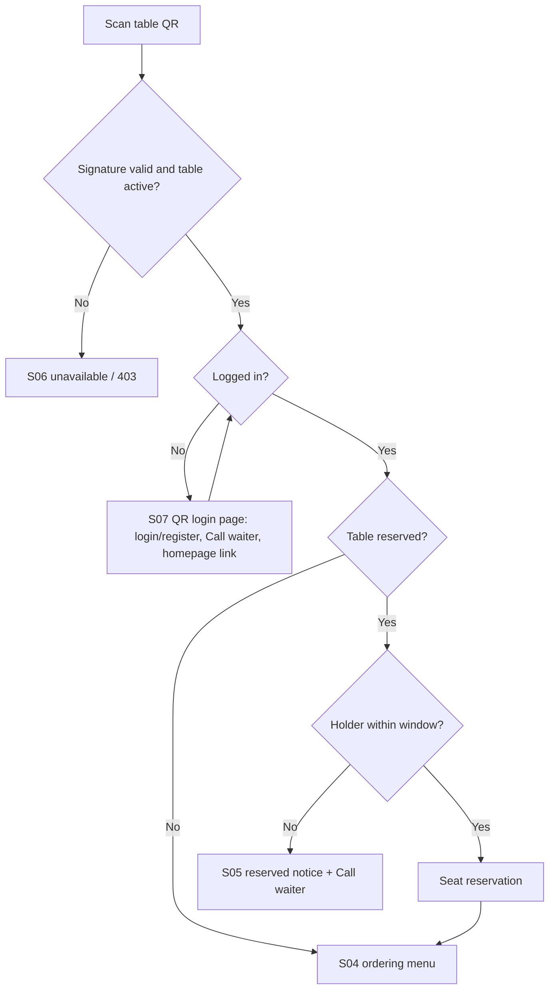
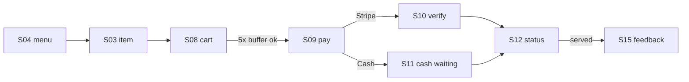
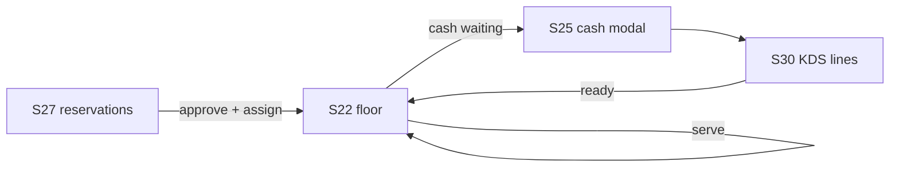

# 8. UI Design

## 8.1 Screen inventory
| ID | Screen | Route | Blade view | Roles | UC |
|---|---|---|---|---|---|
| S01 | Homepage | / | public/home | Visitor, Customer | UC01, UC03, UC13 |
| S02 | Full menu | /menu | public/menu | Visitor, Customer | UC01 |
| S03 | Item detail modal | modal | partials/item-modal | Visitor, Customer | UC01, UC08 |
| S04 | Table ordering menu (cart bar, Call waiter, homepage link) | /t/{table}/{token} | public/menu (ordering mode) | Customer | UC02, UC07, UC08 |
| S05 | Reserved table notice | /t/… | public/table-reserved | Customer | UC07 |
| S06 | Table unavailable | /t/… | public/table-unavailable | Any | UC07 |
| S07 | Login / register / reset / verify; QR login variant with Call waiter and homepage link | /login … | customer/auth/* | Visitor | UC02, UC04, UC05, UC07 |
| S08 | Cart | /cart | customer/cart | Customer | UC08 |
| S09 | Payment choice | /orders/{order}/pay | customer/pay | Customer | UC10 |
| S10 | Payment verifying | /payment/success | customer/payment-return | Customer | UC10 |
| S11 | Cash waiting | /orders/{order} | customer/order | Customer | UC10 |
| S12 | Order status timeline (+ Check payment status) | /orders/{order} | customer/order | Customer | UC11, UC12 |
| S13 | My orders | /orders | customer/orders | Customer | UC11 |
| S14 | Receipt PDF | /orders/{order}/receipt | pdf/receipt | Customer | UC11 |
| S15 | Feedback modal | modal on S12 | partials/feedback-modal | Customer | UC15 |
| S16 | Meal builder | /meal-builder | public/meal-builder | Visitor, Customer | UC09 |
| S17 | Chat widget | S01, S02, S04, S16 | partials/chat | Visitor, Customer | UC09 |
| S18 | Reservation wizard | /#reserve | partials/reserve | Visitor, Customer | UC13 |
| S19 | My reservations | /my/reservations | customer/reservations | Customer | UC14 |
| S20 | Profile | /profile | customer/profile | Customer | UC06 |
| S21 | Staff login | /staff/login | staff/auth/login | Staff | UC05 |
| S22 | Floor view (grid, alerts, ready to serve, cash waiting, paused banner) | /staff/floor | staff/floor/index | Waitstaff, Admin | UC16–UC18, UC21, UC40 |
| S23 | Table drawer | panel | staff/floor/partials/table-drawer | Waitstaff | UC17–UC19 |
| S24 | Take order | /staff/tables/{table}/order | staff/floor/order | Waitstaff | UC19 |
| S25 | Cash payment modal | modal | staff/floor/partials/cash-modal | Waitstaff | UC20 |
| S26 | Stripe QR modal | modal | staff/floor/partials/stripe-qr | Waitstaff | UC19 |
| S27 | Reservations board | /staff/reservations | staff/reservations/index | Waitstaff, Admin | UC22–UC25 |
| S28 | Request review panel with trust profile | panel | staff/reservations/partials/review | Waitstaff, Admin | UC22 |
| S29 | Refund request modal | modal | staff/partials/refund-request | Waitstaff, Kitchen, Bar | UC26 |
| S30 | Station display (kitchen / bar) | /staff/kds/{destination} | staff/kds/index | Kitchen, Bar, Admin | UC28, UC41 |
| S31 | Availability drawer | drawer on S30 | staff/kds/partials/availability | Kitchen, Bar | UC29 |
| S32 | Admin dashboard | /admin | admin/dashboard | Admin | UC35 |
| S33 | Orders | /admin/orders | admin/orders/* | Admin | UC33, UC40, UC41 |
| S34 | Refund queue | /admin/refunds | admin/refunds/index | Admin | UC33 |
| S35 | Menu items list and edit | /admin/menu-items | admin/menu-items/* | Admin | UC32 |
| S36 | Categories, allergens, dietary tags | /admin/categories … | admin/catalogue/* | Admin | UC32 |
| S37 | Tables and QR | /admin/tables | admin/tables/* | Admin | UC31 |
| S38 | Customers | /admin/customers | admin/customers/* | Admin | UC38 |
| S39 | Staff accounts | /admin/staff | admin/staff/* | Admin | UC30 |
| S40 | Feedback moderation | /admin/feedback | admin/feedback/index | Admin | UC34 |
| S41 | Reports | /admin/reports/{type} | admin/reports/* | Admin | UC35 |
| S42 | Audit log and archive | /admin/audit-log | admin/audit/* | Admin | UC36 |
| S43 | Settings, slots, switches | /admin/settings | admin/settings/* | Admin | UC37 |

## 8.2 QR scan flow

## 8.3 Customer ordering flow

## 8.4 Staff flows

## 8.5 Admin dashboard (S32)
| # | Type | Widget | Detail |
|---|---|---|---|
| 1 | Tile | Sales today (gross) | vs same weekday last week |
| 2 | Tile | Orders today | paid orders |
| 3 | Tile | Average order value |  |
| 4 | Tile | Cash vs Stripe | share of paid amount |
| 5 | Tile | Covers booked today | confirmed + seated party sizes |
| 6 | Tile | Pending reservation requests | links to S27 |
| 7 | Tile | Open refund requests | links to S34 |
| 8 | Tile | Average rating (30 days) | food and service |
| 9 | Chart | Sales by hour today | bar |
| 10 | Chart | Sales last 7 / 30 days | line, toggle |
| 11 | Chart | Orders by status now | bar |
| 12 | List | Needs attention | stock conflicts, refund requests, cash waiting > 10 min, unassigned bookings inside T–30, late lines (past ETA) |
| 13 | List | Top 5 items today | qty and revenue |
| 14 | List | Low stock / sold out | remaining < 2× buffer or unavailable |
| 15 | List | Latest feedback | 5 most recent |

Sidebar: Dashboard · Floor view · Orders · Refunds · Reservations · Menu items · Categories & tags · Tables & QR · Customers · Staff · Feedback · Reports · Audit log · Settings.

## 8.6 Homepage (S01)
| Section | Specification |
|---|---|
| Top bar | Logo, Home, Menu, Reviews, About, Sign in / My account, Book a table, search → /menu; hamburger ≤ 820 px |
| Hero | Static image, headline, 'See the menu' |
| Tiles | Our menu → #menu · Order at your table (scan QR) · Plan your meal → /meal-builder |
| About | Static copy |
| Menu section | Specials offer block (largest % discount, end date; hidden if none); category links (Specials first when non-empty → /menu?category=); up to 12 featured items with 'from' price, sale strikethrough, dietary tags, sold-out state; 'View full menu'; QR note |
| Reviews | True averages (food, service, count; hidden < 10) and up to 3 featured cards |
| Reservation wizard | Step 1 date (closed weekdays greyed, ≤ 60 days) → 2 party + time → 3 details (login/verify if needed); paused message when online bookings off |
| Footer | Venue details and socials from settings |
| Chat widget | Menu assistant for everyone; opens from button; 'Build a meal' link; hidden when AI off |
| Happy hour | Removed |

`<!-- DYNAMIC -->` comments in the prototype mark Blade-driven blocks.

## 8.7 UI standards
| Item | Standard |
|---|---|
| Breakpoints (public) | 980 px layout stack · 820 px hamburger · 560 px compact |
| Breakpoints (staff/admin) | 1200 px · 900 px sidebar → hamburger · 560 px |
| CSS | `style.css` (public, master for W3C) · `dashboard.css` (staff/admin); tokens from style.css `:root` |
| Status colours | pending #B8402C · preparing #E8A33D · ready #2E9E5B · served #6B5647 · cancelled #9A8778 |
| Test hooks | `data-testid="<screen>-<action>"`, e.g. `cart-checkout`, `kds-ready`, `floor-cash-confirm` |
| Accessibility | Labels on inputs, alt text, visible focus, 44 px touch targets, reduced-motion support |
| HTML | Valid HTML5 (no self-closing void tags, `lang` set, unique ids) |
| Icons | Inline SVG, `aria-hidden` when decorative |
